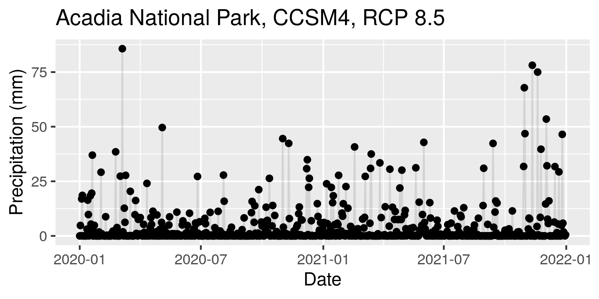

<!-- README.md is generated from README.Rmd. Please edit that file -->

# cft: climate futures toolbox

<!-- badges: start -->

[](https://travis-ci.com/earthlab/cft)
[](https://codecov.io/gh/earthlab/cft)
[](https://www.repostatus.org/#active)
[](https://github.com/earthlab/cft/actions)
[](https://github.com/earthlab/cft/actions)
[](https://zenodo.org/badge/latestdoi/205295577)
<!-- badges: end -->

The goal of cft is to provide easy climate data access ([MACA
v2](http://www.climatologylab.org/maca.html)) to support climate
scenario planning. This package allows you to:

1.  Quickly acquire climate data subsets for a spatial region of
    interest, with first class support for US National Parks
2.  Summarize climate data at daily timesteps, and compute derived
    quantities
3.  Contrast reference and target time periods to understand differences
    in climate over time, and
4.  Easily work with climate data, without having to worry about the
    details of how it is stored or formatted

## Installation

Install the development version of cft from
[GitHub](https://github.com/) with:

``` r
# install.packages("remotes")
remotes::install_github("earthlab/cft")
```

This package also has some python dependencies. We recommend using conda
(preferably [miniconda](https://docs.conda.io/en/latest/miniconda.html))
to simplify the installation process. You can install miniconda with the
[reticulate](https://rstudio.github.io/reticulate/) R package:

``` r
# # install.packages("reticulate")
reticulate::install_miniconda()
```

After installing miniconda, python dependencies can be installed as
follows:

``` r
cft::install_py_deps()
```

### Using Docker instead of a local installation

If you are having trouble installing this package locally, or do not
want to install the package locally, we also provide a
[Docker](https://www.docker.com/) image that has the package and its
dependencies pre-installed, along with RStudio server which can run in a
web browser.

To use the Docker image, you’ll need to have Docker installed (see
[Docker installation instructions
here](https://docs.docker.com/install/)), then run the following command
from a terminal, replacing <yourpassword> with a password of your
choosing.

``` bash
docker run -e PASSWORD=<yourpassword> -d -p 8787:8787 earthlab/cft
```

Then, in a web browser, navigate to localhost:8787. Log in with
username: `rstudio`, and the password you provided.

## Quickstart guide

To get daily precipitation data for Acadia National Park for a subset of
climate models, you can use the `cftdata()` function:

``` r
library(ggplot2)
library(cft)
```

Then, download some data using the `cftdata()` function.

``` r
d <- cftdata(park = "Acadia National Park", parameters = "pr", 
             years = c(2020, 2021), models = "CCSM4", scenarios = "rcp85")
```

This gives you a data frame with paths to local climate data files:

``` r
str(d)
#> tibble [1 × 13] (S3: tbl_df/tbl/data.frame)
#>  $ local_file      : Named chr "pr_acadia_national_park_CCSM4_r6i1p1_rcp85_macav2metdata_2020_2021_daily.nc"
#>   ..- attr(*, "names")= chr "local_file"
#>  $ local_path      : Named chr "/home/mjoseph/acadia_national_park/pr_acadia_national_park_CCSM4_r6i1p1_rcp85_macav2metdata_2020_2021_daily.nc"
#>   ..- attr(*, "names")= chr "local_path"
#>  $ model           : Named chr "CCSM4"
#>   ..- attr(*, "names")= chr "model"
#>  $ parameter       : Named chr "pr"
#>   ..- attr(*, "names")= chr "parameter"
#>  $ rcp             : Named chr "rcp85"
#>   ..- attr(*, "names")= chr "rcp"
#>  $ ensemble        : Named chr "r6i1p1"
#>   ..- attr(*, "names")= chr "ensemble"
#>  $ year1           : Named num 2020
#>   ..- attr(*, "names")= chr "year1"
#>  $ year2           : Named num 2021
#>   ..- attr(*, "names")= chr "year2"
#>  $ area_name       : Named chr "acadia_national_park"
#>   ..- attr(*, "names")= chr "area_name"
#>  $ units           : Named chr "mm"
#>   ..- attr(*, "names")= chr "units"
#>  $ full_varname    : Named chr "Precipitation"
#>   ..- attr(*, "names")= chr "full_varname"
#>  $ internal_varname: Named chr "precipitation"
#>   ..- attr(*, "names")= chr "internal_varname"
#>  $ parameter_long  : Named chr "precipitation"
#>   ..- attr(*, "names")= chr "parameter.pr"
```

And, you can also summarize the daily data by computing a spatial
average over the region of interest:

``` r
df <- cft_df(d, ncores = 2)
#> Computing spatial averages...
#> Generating climate data.frame...
str(df)
#> tibble [731 × 6] (S3: tbl_df/tbl/data.frame)
#>  $ rcp      : Named chr [1:731] "rcp85" "rcp85" "rcp85" "rcp85" ...
#>   ..- attr(*, "names")= chr [1:731] "rcp" "rcp" "rcp" "rcp" ...
#>  $ date     : Date[1:731], format: "2020-01-01" "2020-01-02" ...
#>  $ model    : Named chr [1:731] "CCSM4" "CCSM4" "CCSM4" "CCSM4" ...
#>   ..- attr(*, "names")= chr [1:731] "model" "model" "model" "model" ...
#>  $ ensemble : Named chr [1:731] "r6i1p1" "r6i1p1" "r6i1p1" "r6i1p1" ...
#>   ..- attr(*, "names")= chr [1:731] "ensemble" "ensemble" "ensemble" "ensemble" ...
#>  $ area_name: Named chr [1:731] "acadia_national_park" "acadia_national_park" "acadia_national_park" "acadia_national_park" ...
#>   ..- attr(*, "names")= chr [1:731] "area_name" "area_name" "area_name" "area_name" ...
#>  $ pr       : Named num [1:731] 0 4.7804 0.0497 16.9338 18.5549 ...
#>   ..- attr(*, "names")= chr [1:731] "" "" "" "" ...
```

Because this is a data.frame, you can use all of the normal data
visualization and processing functionality in R, e.g.,

``` r
df %>%
  ggplot(aes(date, pr)) + 
  geom_point() + 
  geom_line(alpha = .1) + 
  xlab("Date") + 
  ylab("Precipitation (mm)") + 
  ggtitle("Acadia National Park, CCSM4, RCP 8.5")
```



### Dive deeper

This is just a small glimpse at what you can do with the cft package.
For more, see [Getting started with the Climate Futures
Toolbox](https://www.earthdatascience.org/cft/articles/cft-intro.html).

## Development instructions

### Building documentation

The vignettes in this package are pre-rendered because they take a while
to execute. The `Makefile` contains instructions for rendering the
vignettes, as well as the manual and README.md file. To build the
documentation, execute the following command from the terminal:

``` bash
make
```

## Meta

  - Please [report any issues or
    bugs](https://github.com/earthlab/cft/issues), after reading our
    contribution [guidelines](CONTRIBUTING.md), and the [Contributor
    Code of Conduct](CODE_OF_CONDUCT.md).
  - License: GPL-3
  - See `citation("cft")` in R to cite this package in publications.
