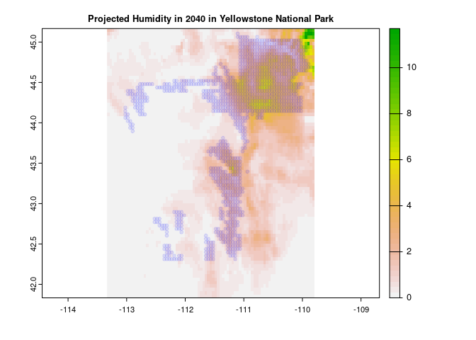
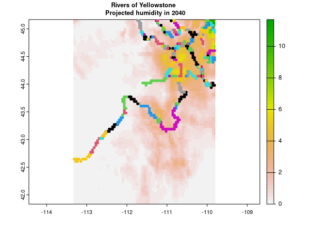
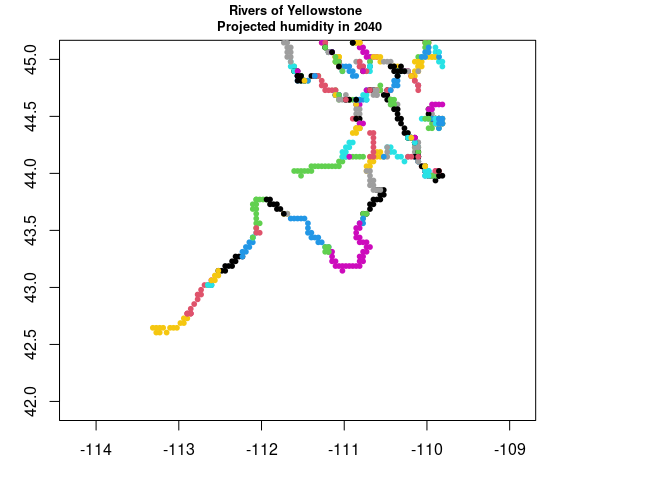
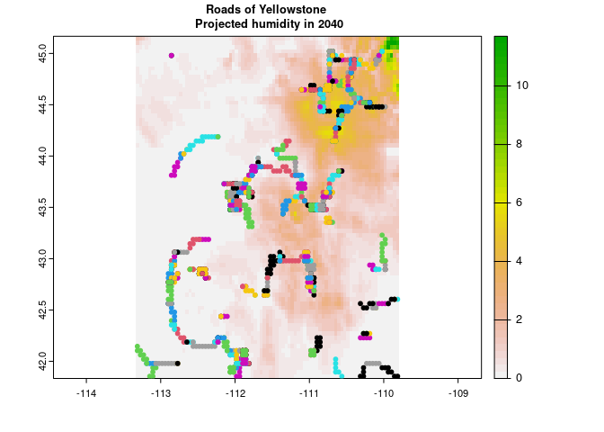
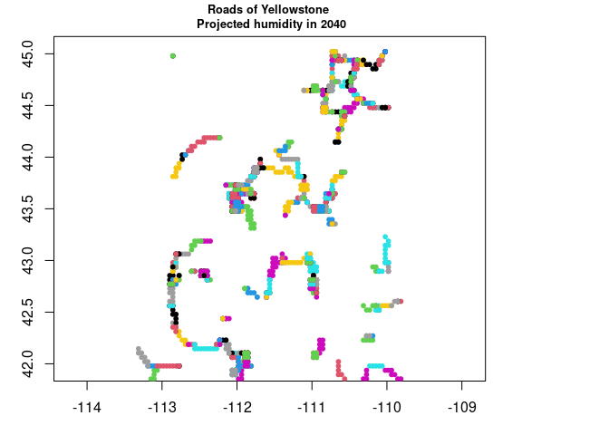

R Notebook
================

# Welcome to the Climate Future Toolbox’s Available Data function

This vignette provides a walk-through of a common use case of the
Available Data function and the cft package: understanding climate
futures for a region of interest. We’ll use Hot Springs National Park,
located in Arkansas, USA and Yellowstone National Park, located in
Wyoming, USA, as case studies.

Note that the available_data function is best used for downloading MACA
climate model data for several climate variables from several climate
models for any number of emission scenarios over a relatively small
spatial region and over a relatively short time period. If you would
like to download MACA climate model data for several climate variables
from several climate models and any number of emission scenarios in
their entirety for a single lat/long location, you should use the
single_point_firehose function in the cft pacakge. A vignette on how to
use the firehose function in the cft package is available at
<https://github.com/earthlab/cft/blob/main/vignettes/firehose.md>.

### What you’ll learn

This vignette will show you how to:

-   Access climate data for a spatial region of interest
-   Produce a `data.frame` containing climate data
-   Visualize historical and future data
-   Generate and analyze new climate variables

### What you’ll need

To get the most out of this vignette, we assume you have:

-   At least 500 MB of disk space
-   Some familiarity with ggplot2
-   Some familiarity with dplyr (e.g.,
    [`filter()`](https://www.rdocumentation.org/packages/dplyr/versions/0.7.8/topics/filter),
    [`group_by()`](https://www.rdocumentation.org/packages/dplyr/versions/0.7.8/topics/group_by),
    and
    [`summarise()`](https://www.rdocumentation.org/packages/dplyr/versions/0.7.8/topics/summarise))

## About the data

Global Circulation Models (GCMs) provide estimates of historical and
future climate conditions. The complexity of the climate system has lead
to a large number GCMs and it is common practice to examine outputs from
many different models, treating each as one plausible future.

Most GCMs are spatially coarse (often 1 degree), but downscaling
provides finer scale estimates. The cft package uses one downscaled
climate model called MACA (Multivariate Adaptive Climate Analog) Version
2 ([details here](http://www.climatologylab.org/maca.html)).

### Acquiring and subsetting data within National Park Service boundaries

This package was originally written with the National Park Service in
mind, so it has the option to use the name of any park (or monument,
preserve, etc.) within the NPS. Use the `cftdata()` function to specify
a range of years, a set of models, a set of parameters, and a set of
representative concentration pathways to return. Leaving these arguments
empty will result in a download of all available data for that location.

# Loading the cft package from github

``` r
library(devtools)
install_github("earthlab/cft")
```

## Attach cft and check the list of available functions

``` r
library(cft)
```

    ## Loading required package: dplyr

    ## 
    ## Attaching package: 'dplyr'

    ## The following objects are masked from 'package:stats':
    ## 
    ##     filter, lag

    ## The following objects are masked from 'package:base':
    ## 
    ##     intersect, setdiff, setequal, union

    ## Loading required package: tidync

    ## Loading required package: tidyr

    ## Loading required package: lubridate

    ## 
    ## Attaching package: 'lubridate'

    ## The following objects are masked from 'package:base':
    ## 
    ##     date, intersect, setdiff, union

    ## Loading required package: osmdata

    ## Data (c) OpenStreetMap contributors, ODbL 1.0. https://www.openstreetmap.org/copyright

    ## Loading required package: sf

    ## Linking to GEOS 3.8.0, GDAL 3.0.4, PROJ 6.3.1; sf_use_s2() is TRUE

    ## Loading required package: stars

    ## Loading required package: abind

    ## Loading required package: epitools

    ## Loading required package: raster

    ## Loading required package: sp

    ## 
    ## Attaching package: 'raster'

    ## The following object is masked from 'package:dplyr':
    ## 
    ##     select

    ## Loading required package: ggplot2

    ## Loading required package: future

    ## 
    ## Attaching package: 'future'

    ## The following object is masked from 'package:raster':
    ## 
    ##     values

    ## Loading required package: furrr

    ## Loading required package: rlist

    ## Loading required package: plyr

    ## ------------------------------------------------------------------------------

    ## You have loaded plyr after dplyr - this is likely to cause problems.
    ## If you need functions from both plyr and dplyr, please load plyr first, then dplyr:
    ## library(plyr); library(dplyr)

    ## ------------------------------------------------------------------------------

    ## 
    ## Attaching package: 'plyr'

    ## The following objects are masked from 'package:dplyr':
    ## 
    ##     arrange, count, desc, failwith, id, mutate, rename, summarise,
    ##     summarize

    ## Loading required package: pipeR

``` r
ls(pos="package:cft")
```

    ## [1] "available_data"        "single_point_firehose"

# Use read-only mode to find available data without initiating a full download.

``` r
inputs <- cft::available_data()
```

    ## Trying to connect to the USGS.gov API

    ## not a file: 
    ## ' https://cida.usgs.gov/thredds/dodsC/macav2metdata_daily_future '
    ## 
    ## ... attempting remote connection

    ## Connection succeeded.

    ## Reading results

    ## Converting into an R data.table

## Look at the documentation for those functions

``` r
?available_data
?single_point_firehose
```

Look at the variables, emission scenarios, and models for which data are
available

``` r
levels(as.factor(inputs$variable_names$Variable))
```

    ## [1] "Eastward Wind"                       "Maximum Relative Humidity"          
    ## [3] "Maximum Temperature"                 "Minimum Relative Humidity"          
    ## [5] "Minimum Temperature"                 "Northward Wind"                     
    ## [7] "Precipitation"                       "Specific Humidity"                  
    ## [9] "Surface Downswelling Shortwave Flux"

``` r
levels(as.factor(inputs$variable_names$`Variable abbreviation`))
```

    ## [1] "huss"   "pr"     "rhsmax" "rhsmin" "rsds"   "tasmax" "tasmin" "uas"   
    ## [9] "vas"

``` r
levels(as.factor(inputs$variable_names$Scenario))
```

    ## [1] "RCP 4.5" "RCP 8.5"

``` r
levels(as.factor(inputs$variable_names$`Scenario abbreviation`))
```

    ## [1] "rcp45" "rcp85"

``` r
levels(as.factor(inputs$variable_names$Model))
```

    ##  [1] "Beijing Climate Center - Climate System Model 1.1"                                            
    ##  [2] "Beijing Normal University - Earth System Model"                                               
    ##  [3] "Canadian Earth System Model 2"                                                                
    ##  [4] "Centre National de Recherches Météorologiques - Climate Model 5"                              
    ##  [5] "Commonwealth Scientific and Industrial Research Organisation - Mk3.6.0"                       
    ##  [6] "Community Climate System Model 4"                                                             
    ##  [7] "Geophysical Fluid Dynamics Laboratory - Earth System Model 2 Generalized Ocean Layer Dynamics"
    ##  [8] "Geophysical Fluid Dynamics Laboratory - Earth System Model 2 Modular Ocean"                   
    ##  [9] "Hadley Global Environment Model 2 - Climate Chemistry 365 (day) "                             
    ## [10] "Hadley Global Environment Model 2 - Earth System 365 (day)"                                   
    ## [11] "Institut Pierre Simon Laplace (IPSL) - Climate Model 5A - Low Resolution"                     
    ## [12] "Institut Pierre Simon Laplace (IPSL) - Climate Model 5A - Medium Resolution"                  
    ## [13] "Institut Pierre Simon Laplace (IPSL) - Climate Model 5B - Low Resolution"                     
    ## [14] "Institute of Numerical Mathematics Climate Model 4"                                           
    ## [15] "Meteorological Research Institute - Coupled Global Climate Model 3"                           
    ## [16] "Model for Interdisciplinary Research On Climate - Earth System Model"                         
    ## [17] "Model for Interdisciplinary Research On Climate - Earth System Model - Chemistry"             
    ## [18] "Model for Interdisciplinary Research On Climate 5"                                            
    ## [19] "Norwegian Earth System Model 1 - Medium Resolution"

``` r
levels(as.factor(inputs$variable_names$`Model abbreviation`))
```

    ##  [1] "bcc-csm1-1"     "bcc-csm1-1-m"   "BNU-ESM"        "CanESM2"       
    ##  [5] "CCSM4"          "CNRM-CM5"       "CSIRO-Mk3-6-0"  "GFDL-ESM2G"    
    ##  [9] "GFDL-ESM2M"     "HadGEM2-CC365"  "HadGEM2-ES365"  "inmcm4"        
    ## [13] "IPSL-CM5A-LR"   "IPSL-CM5A-MR"   "IPSL-CM5B-LR"   "MIROC-ESM"     
    ## [17] "MIROC-ESM-CHEM" "MIROC5"         "MRI-CGCM3"      "NorESM1-M"

This code downloads data for all models, all emission scenarios, and 5
climate variables. Notice that this is a large download request.

``` r
input_variables <- inputs$variable_names %>% 
  filter(Variable %in% c("Maximum Relative Humidity", 
                       "Maximum Temperature", 
                       "Minimum Relative Humidity",          
                       "Minimum Temperature",                 
                       "Precipitation")) %>% 
  filter(Scenario %in% c( "RCP 4.5", "RCP 8.5")) %>% 
  filter(Model %in% c(
    "Beijing Climate Center - Climate System Model 1.1",
    "Beijing Normal University - Earth System Model",
    "Canadian Earth System Model 2",                                                                
  "Centre National de Recherches Météorologiques - Climate Model 5",                              
  "Commonwealth Scientific and Industrial Research Organisation - Mk3.6.0",                       
  "Community Climate System Model 4",                                                             
  "Geophysical Fluid Dynamics Laboratory - Earth System Model 2 Generalized Ocean Layer Dynamics",
  "Geophysical Fluid Dynamics Laboratory - Earth System Model 2 Modular Ocean",                   
  "Hadley Global Environment Model 2 - Climate Chemistry 365 (day) ",                             
 "Hadley Global Environment Model 2 - Earth System 365 (day)",                                   
 "Institut Pierre Simon Laplace (IPSL) - Climate Model 5A - Low Resolution",                     
 "Institut Pierre Simon Laplace (IPSL) - Climate Model 5A - Medium Resolution",                  
 "Institut Pierre Simon Laplace (IPSL) - Climate Model 5B - Low Resolution",                     
 "Institute of Numerical Mathematics Climate Model 4",                                           
 "Meteorological Research Institute - Coupled Global Climate Model 3",                           
 "Model for Interdisciplinary Research On Climate - Earth System Model",                         
 "Model for Interdisciplinary Research On Climate - Earth System Model - Chemistry",             
 "Model for Interdisciplinary Research On Climate 5",                                            
 "Norwegian Earth System Model 1 - Medium Resolution"  )) %>%
  
  pull("Available variable")

input_variables
```

    ##   [1] "pr_BNU-ESM_r1i1p1_rcp45"            "pr_BNU-ESM_r1i1p1_rcp85"           
    ##   [3] "pr_CCSM4_r6i1p1_rcp45"              "pr_CCSM4_r6i1p1_rcp85"             
    ##   [5] "pr_CNRM-CM5_r1i1p1_rcp45"           "pr_CNRM-CM5_r1i1p1_rcp85"          
    ##   [7] "pr_CSIRO-Mk3-6-0_r1i1p1_rcp45"      "pr_CSIRO-Mk3-6-0_r1i1p1_rcp85"     
    ##   [9] "pr_CanESM2_r1i1p1_rcp45"            "pr_CanESM2_r1i1p1_rcp85"           
    ##  [11] "pr_GFDL-ESM2G_r1i1p1_rcp45"         "pr_GFDL-ESM2G_r1i1p1_rcp85"        
    ##  [13] "pr_GFDL-ESM2M_r1i1p1_rcp45"         "pr_GFDL-ESM2M_r1i1p1_rcp85"        
    ##  [15] "pr_HadGEM2-CC365_r1i1p1_rcp45"      "pr_HadGEM2-CC365_r1i1p1_rcp85"     
    ##  [17] "pr_HadGEM2-ES365_r1i1p1_rcp45"      "pr_HadGEM2-ES365_r1i1p1_rcp85"     
    ##  [19] "pr_IPSL-CM5A-LR_r1i1p1_rcp45"       "pr_IPSL-CM5A-LR_r1i1p1_rcp85"      
    ##  [21] "pr_IPSL-CM5A-MR_r1i1p1_rcp45"       "pr_IPSL-CM5A-MR_r1i1p1_rcp85"      
    ##  [23] "pr_IPSL-CM5B-LR_r1i1p1_rcp45"       "pr_IPSL-CM5B-LR_r1i1p1_rcp85"      
    ##  [25] "pr_MIROC-ESM-CHEM_r1i1p1_rcp45"     "pr_MIROC-ESM-CHEM_r1i1p1_rcp85"    
    ##  [27] "pr_MIROC-ESM_r1i1p1_rcp85"          "pr_MIROC-ESM_r1i1p1_rcp45"         
    ##  [29] "pr_MIROC5_r1i1p1_rcp45"             "pr_MIROC5_r1i1p1_rcp85"            
    ##  [31] "pr_MRI-CGCM3_r1i1p1_rcp45"          "pr_MRI-CGCM3_r1i1p1_rcp85"         
    ##  [33] "pr_NorESM1-M_r1i1p1_rcp45"          "pr_NorESM1-M_r1i1p1_rcp85"         
    ##  [35] "pr_bcc-csm1-1_r1i1p1_rcp45"         "pr_bcc-csm1-1_r1i1p1_rcp85"        
    ##  [37] "pr_inmcm4_r1i1p1_rcp45"             "pr_inmcm4_r1i1p1_rcp85"            
    ##  [39] "rhsmax_BNU-ESM_r1i1p1_rcp45"        "rhsmax_BNU-ESM_r1i1p1_rcp85"       
    ##  [41] "rhsmax_CNRM-CM5_r1i1p1_rcp45"       "rhsmax_CNRM-CM5_r1i1p1_rcp85"      
    ##  [43] "rhsmax_CSIRO-Mk3-6-0_r1i1p1_rcp45"  "rhsmax_CSIRO-Mk3-6-0_r1i1p1_rcp85" 
    ##  [45] "rhsmax_CanESM2_r1i1p1_rcp45"        "rhsmax_CanESM2_r1i1p1_rcp85"       
    ##  [47] "rhsmax_GFDL-ESM2G_r1i1p1_rcp45"     "rhsmax_GFDL-ESM2G_r1i1p1_rcp85"    
    ##  [49] "rhsmax_GFDL-ESM2M_r1i1p1_rcp45"     "rhsmax_HadGEM2-CC365_r1i1p1_rcp45" 
    ##  [51] "rhsmax_HadGEM2-CC365_r1i1p1_rcp85"  "rhsmax_HadGEM2-ES365_r1i1p1_rcp45" 
    ##  [53] "rhsmax_HadGEM2-ES365_r1i1p1_rcp85"  "rhsmax_IPSL-CM5A-LR_r1i1p1_rcp45"  
    ##  [55] "rhsmax_IPSL-CM5A-LR_r1i1p1_rcp85"   "rhsmax_IPSL-CM5A-MR_r1i1p1_rcp45"  
    ##  [57] "rhsmax_IPSL-CM5A-MR_r1i1p1_rcp85"   "rhsmax_IPSL-CM5B-LR_r1i1p1_rcp45"  
    ##  [59] "rhsmax_IPSL-CM5B-LR_r1i1p1_rcp85"   "rhsmax_MIROC-ESM-CHEM_r1i1p1_rcp45"
    ##  [61] "rhsmax_MIROC-ESM-CHEM_r1i1p1_rcp85" "rhsmax_MIROC-ESM_r1i1p1_rcp45"     
    ##  [63] "rhsmax_MIROC-ESM_r1i1p1_rcp85"      "rhsmax_MIROC5_r1i1p1_rcp45"        
    ##  [65] "rhsmax_MIROC5_r1i1p1_rcp85"         "rhsmax_MRI-CGCM3_r1i1p1_rcp45"     
    ##  [67] "rhsmax_MRI-CGCM3_r1i1p1_rcp85"      "rhsmax_bcc-csm1-1_r1i1p1_rcp45"    
    ##  [69] "rhsmax_bcc-csm1-1_r1i1p1_rcp85"     "rhsmax_inmcm4_r1i1p1_rcp45"        
    ##  [71] "rhsmax_inmcm4_r1i1p1_rcp85"         "rhsmin_BNU-ESM_r1i1p1_rcp45"       
    ##  [73] "rhsmin_BNU-ESM_r1i1p1_rcp85"        "rhsmin_CNRM-CM5_r1i1p1_rcp45"      
    ##  [75] "rhsmin_CNRM-CM5_r1i1p1_rcp85"       "rhsmin_CSIRO-Mk3-6-0_r1i1p1_rcp45" 
    ##  [77] "rhsmin_CSIRO-Mk3-6-0_r1i1p1_rcp85"  "rhsmin_CanESM2_r1i1p1_rcp45"       
    ##  [79] "rhsmin_CanESM2_r1i1p1_rcp85"        "rhsmin_GFDL-ESM2G_r1i1p1_rcp45"    
    ##  [81] "rhsmin_GFDL-ESM2G_r1i1p1_rcp85"     "rhsmin_GFDL-ESM2M_r1i1p1_rcp45"    
    ##  [83] "rhsmin_GFDL-ESM2M_r1i1p1_rcp85"     "rhsmin_HadGEM2-CC365_r1i1p1_rcp45" 
    ##  [85] "rhsmin_HadGEM2-CC365_r1i1p1_rcp85"  "rhsmin_HadGEM2-ES365_r1i1p1_rcp45" 
    ##  [87] "rhsmin_HadGEM2-ES365_r1i1p1_rcp85"  "rhsmin_IPSL-CM5A-LR_r1i1p1_rcp45"  
    ##  [89] "rhsmin_IPSL-CM5A-LR_r1i1p1_rcp85"   "rhsmin_IPSL-CM5A-MR_r1i1p1_rcp45"  
    ##  [91] "rhsmin_IPSL-CM5A-MR_r1i1p1_rcp85"   "rhsmin_IPSL-CM5B-LR_r1i1p1_rcp45"  
    ##  [93] "rhsmin_IPSL-CM5B-LR_r1i1p1_rcp85"   "rhsmin_MIROC-ESM-CHEM_r1i1p1_rcp45"
    ##  [95] "rhsmin_MIROC-ESM-CHEM_r1i1p1_rcp85" "rhsmin_MIROC-ESM_r1i1p1_rcp45"     
    ##  [97] "rhsmin_MIROC-ESM_r1i1p1_rcp85"      "rhsmin_MIROC5_r1i1p1_rcp45"        
    ##  [99] "rhsmin_MIROC5_r1i1p1_rcp85"         "rhsmin_MRI-CGCM3_r1i1p1_rcp45"     
    ## [101] "rhsmin_MRI-CGCM3_r1i1p1_rcp85"      "rhsmin_bcc-csm1-1_r1i1p1_rcp45"    
    ## [103] "rhsmin_bcc-csm1-1_r1i1p1_rcp85"     "rhsmin_inmcm4_r1i1p1_rcp45"        
    ## [105] "rhsmin_inmcm4_r1i1p1_rcp85"         "tasmax_BNU-ESM_r1i1p1_rcp45"       
    ## [107] "tasmax_BNU-ESM_r1i1p1_rcp85"        "tasmax_CCSM4_r6i1p1_rcp45"         
    ## [109] "tasmax_CCSM4_r6i1p1_rcp85"          "tasmax_CNRM-CM5_r1i1p1_rcp45"      
    ## [111] "tasmax_CNRM-CM5_r1i1p1_rcp85"       "tasmax_CSIRO-Mk3-6-0_r1i1p1_rcp45" 
    ## [113] "tasmax_CSIRO-Mk3-6-0_r1i1p1_rcp85"  "tasmax_CanESM2_r1i1p1_rcp45"       
    ## [115] "tasmax_CanESM2_r1i1p1_rcp85"        "tasmax_GFDL-ESM2G_r1i1p1_rcp45"    
    ## [117] "tasmax_GFDL-ESM2G_r1i1p1_rcp85"     "tasmax_GFDL-ESM2M_r1i1p1_rcp45"    
    ## [119] "tasmax_GFDL-ESM2M_r1i1p1_rcp85"     "tasmax_HadGEM2-CC365_r1i1p1_rcp45" 
    ## [121] "tasmax_HadGEM2-CC365_r1i1p1_rcp85"  "tasmax_HadGEM2-ES365_r1i1p1_rcp45" 
    ## [123] "tasmax_HadGEM2-ES365_r1i1p1_rcp85"  "tasmax_IPSL-CM5A-LR_r1i1p1_rcp45"  
    ## [125] "tasmax_IPSL-CM5A-LR_r1i1p1_rcp85"   "tasmax_IPSL-CM5A-MR_r1i1p1_rcp45"  
    ## [127] "tasmax_IPSL-CM5A-MR_r1i1p1_rcp85"   "tasmax_IPSL-CM5B-LR_r1i1p1_rcp45"  
    ## [129] "tasmax_IPSL-CM5B-LR_r1i1p1_rcp85"   "tasmax_MIROC-ESM-CHEM_r1i1p1_rcp45"
    ## [131] "tasmax_MIROC-ESM-CHEM_r1i1p1_rcp85" "tasmax_MIROC-ESM_r1i1p1_rcp45"     
    ## [133] "tasmax_MIROC-ESM_r1i1p1_rcp85"      "tasmax_MIROC5_r1i1p1_rcp45"        
    ## [135] "tasmax_MIROC5_r1i1p1_rcp85"         "tasmax_MRI-CGCM3_r1i1p1_rcp45"     
    ## [137] "tasmax_MRI-CGCM3_r1i1p1_rcp85"      "tasmax_NorESM1-M_r1i1p1_rcp45"     
    ## [139] "tasmax_NorESM1-M_r1i1p1_rcp85"      "tasmax_bcc-csm1-1_r1i1p1_rcp45"    
    ## [141] "tasmax_bcc-csm1-1_r1i1p1_rcp85"     "tasmax_inmcm4_r1i1p1_rcp45"        
    ## [143] "tasmax_inmcm4_r1i1p1_rcp85"         "tasmin_BNU-ESM_r1i1p1_rcp45"       
    ## [145] "tasmin_BNU-ESM_r1i1p1_rcp85"        "tasmin_CCSM4_r6i1p1_rcp45"         
    ## [147] "tasmin_CCSM4_r6i1p1_rcp85"          "tasmin_CNRM-CM5_r1i1p1_rcp45"      
    ## [149] "tasmin_CNRM-CM5_r1i1p1_rcp85"       "tasmin_CSIRO-Mk3-6-0_r1i1p1_rcp45" 
    ## [151] "tasmin_CSIRO-Mk3-6-0_r1i1p1_rcp85"  "tasmin_CanESM2_r1i1p1_rcp45"       
    ## [153] "tasmin_CanESM2_r1i1p1_rcp85"        "tasmin_GFDL-ESM2G_r1i1p1_rcp45"    
    ## [155] "tasmin_GFDL-ESM2G_r1i1p1_rcp85"     "tasmin_GFDL-ESM2M_r1i1p1_rcp45"    
    ## [157] "tasmin_GFDL-ESM2M_r1i1p1_rcp85"     "tasmin_HadGEM2-CC365_r1i1p1_rcp45" 
    ## [159] "tasmin_HadGEM2-CC365_r1i1p1_rcp85"  "tasmin_HadGEM2-ES365_r1i1p1_rcp45" 
    ## [161] "tasmin_HadGEM2-ES365_r1i1p1_rcp85"  "tasmin_IPSL-CM5A-LR_r1i1p1_rcp45"  
    ## [163] "tasmin_IPSL-CM5A-LR_r1i1p1_rcp85"   "tasmin_IPSL-CM5A-MR_r1i1p1_rcp45"  
    ## [165] "tasmin_IPSL-CM5A-MR_r1i1p1_rcp85"   "tasmin_IPSL-CM5B-LR_r1i1p1_rcp45"  
    ## [167] "tasmin_IPSL-CM5B-LR_r1i1p1_rcp85"   "tasmin_MIROC-ESM-CHEM_r1i1p1_rcp45"
    ## [169] "tasmin_MIROC-ESM-CHEM_r1i1p1_rcp85" "tasmin_MIROC-ESM_r1i1p1_rcp45"     
    ## [171] "tasmin_MIROC-ESM_r1i1p1_rcp85"      "tasmin_MIROC5_r1i1p1_rcp45"        
    ## [173] "tasmin_MIROC5_r1i1p1_rcp85"         "tasmin_MRI-CGCM3_r1i1p1_rcp45"     
    ## [175] "tasmin_MRI-CGCM3_r1i1p1_rcp85"      "tasmin_NorESM1-M_r1i1p1_rcp45"     
    ## [177] "tasmin_NorESM1-M_r1i1p1_rcp85"      "tasmin_bcc-csm1-1_r1i1p1_rcp45"    
    ## [179] "tasmin_bcc-csm1-1_r1i1p1_rcp85"     "tasmin_inmcm4_r1i1p1_rcp45"        
    ## [181] "tasmin_inmcm4_r1i1p1_rcp85"

# Establish area of interst (AOI) by bounding box

You will need to specify an appropriate area of interest for downloading
spatial data. We utilize the functionality of open street map to make it
fast and easy to download shapefiles for any area of interest. Here I am
using the open street map (OSM) protocol to retrieve a shapefile for Hot
Springs National Park. I choice this park because it is the smallest
national park.

This chunk of code is first using the
[getbb()](https://www.rdocumentation.org/packages/osmdata/versions/0.1.9/topics/getbb)
function to retrieve a bounding box matching a plain language search
request. That bounding box is then fed into the API call that retrieves
the data and converts it into an r-specific spatial data format called
sf.

OSM uses a ‘key’ and ‘value’ system for organizing requests. You may
want to spend some time familiarizing yourself with the immense library
of data you can access with this system.
<https://wiki.openstreetmap.org/wiki/Tags>

``` r
bb <- getbb("Hot Springs")
my_boundary <- opq(bb) %>% 
  add_osm_feature(key = "boundary", value = "national_park") %>% 
osmdata_sf() 
```

    ## Error in curl::curl_fetch_memory(url, handle = handle): HTTP/2 stream 0 was not closed cleanly: PROTOCOL_ERROR (err 1)
    ## Request failed [ERROR]. Retrying in 1 seconds...

``` r
my_boundary
```

    ## Object of class 'osmdata' with:
    ##                  $bbox : 34.3438393,-93.2152437,34.6638393,-92.8952437
    ##         $overpass_call : The call submitted to the overpass API
    ##                  $meta : metadata including timestamp and version numbers
    ##            $osm_points : 'sf' Simple Features Collection with 611 points
    ##             $osm_lines : NULL
    ##          $osm_polygons : 'sf' Simple Features Collection with 2 polygons
    ##        $osm_multilines : NULL
    ##     $osm_multipolygons : 'sf' Simple Features Collection with 1 multipolygons

Here you re-calibrate the bounding box relative to the actual shapefiles
you downloaded. The bounding box above was pulled from the osm database,
this bounding box is for the polygons you actually used. These two boxes
may be the same or they may be different but the one derived from your
downloaded shapefile is reproducible.

Notice that we specify osm_multipolygons instead of osm_polygons. This
is a case-specific choice. When you download a shapefile from OSM, if
will include a number of different spatial object types and you can
choose several of those options to move forward. We chose multipolygons
because they best matched our area of interest. Use the quick plot below
to visualize your area of interest before continuing.

``` r
boundaries <- my_boundary$osm_multipolygons
pulled_bb <- st_bbox(boundaries)
pulled_bb
```

    ##      xmin      ymin      xmax      ymax 
    ## -93.11393  34.49884 -93.01857  34.55948

This quick map allows you to check that the polygon you downloaded
matches your expectations.

``` r
basemap <- ggplot(data = boundaries) +
  geom_sf(fill = "cornflowerblue") +
  geom_sf_text(aes(label = boundaries$name)) 

basemap
```

<!-- -->

# Download full time series from a single point

WARNING: TIME CONSUMING STEPS AHEAD

It’s time to download. Here is a simple and fast example of data from a
single point (the centroid of our polygon) for one year (2099). On our
local machine this takes \~3 minutes.

``` r
start_time <- Sys.time()

center_point <- st_centroid(boundaries) %>% st_bbox(center_point)
```

    ## Warning in st_centroid.sf(boundaries): st_centroid assumes attributes are
    ## constant over geometries of x

``` r
times <- inputs$available_times

Pulled_data_single_space_single_timepoint <- inputs$src %>% 
  hyper_filter(lat = lat <= c(center_point[4]+0.05) & lat >= c(center_point[2]-0.05)) %>% 
  hyper_filter(lon = lon <= c(center_point[3]+0.05) & lon >= c(center_point[1]-0.05)) %>%
  hyper_filter(time = times$`Available times` ==  44558) %>% 
  hyper_tibble(select_var = input_variables[1:38]) %>%
  st_as_sf(coords = c("lon", "lat"), crs = 4326, agr = "constant") 

end_time <- Sys.time()
print(end_time - start_time)
```

    ## Time difference of 1.033533 mins

``` r
head(Pulled_data_single_space_single_timepoint)
```

    ## Simple feature collection with 6 features and 39 fields
    ## Attribute-geometry relationship: 39 constant, 0 aggregate, 0 identity
    ## Geometry type: POINT
    ## Dimension:     XY
    ## Bounding box:  xmin: -93.10602 ymin: 34.4796 xmax: -93.02267 ymax: 34.52126
    ## Geodetic CRS:  WGS 84
    ## # A tibble: 6 × 40
    ##   `pr_BNU-ESM_r1i1p1_rcp45` `pr_BNU-ESM_r1i1…` pr_CCSM4_r6i1p1… pr_CCSM4_r6i1p1…
    ##                       <dbl>              <dbl>            <dbl>            <dbl>
    ## 1                      9.70                  0             2.10                0
    ## 2                      9.40                  0             2.20                0
    ## 3                      9.60                  0             2.10                0
    ## 4                      9.70                  0             2.00                0
    ## 5                      9.10                  0             2.10                0
    ## 6                      9.40                  0             2.00                0
    ## # … with 36 more variables: `pr_CNRM-CM5_r1i1p1_rcp45` <dbl>,
    ## #   `pr_CNRM-CM5_r1i1p1_rcp85` <dbl>, `pr_CSIRO-Mk3-6-0_r1i1p1_rcp45` <dbl>,
    ## #   `pr_CSIRO-Mk3-6-0_r1i1p1_rcp85` <dbl>, pr_CanESM2_r1i1p1_rcp45 <dbl>,
    ## #   pr_CanESM2_r1i1p1_rcp85 <dbl>, `pr_GFDL-ESM2G_r1i1p1_rcp45` <dbl>,
    ## #   `pr_GFDL-ESM2G_r1i1p1_rcp85` <dbl>, `pr_GFDL-ESM2M_r1i1p1_rcp45` <dbl>,
    ## #   `pr_GFDL-ESM2M_r1i1p1_rcp85` <dbl>, `pr_HadGEM2-CC365_r1i1p1_rcp45` <dbl>,
    ## #   `pr_HadGEM2-CC365_r1i1p1_rcp85` <dbl>, …

If you try to download a large quantity of data, you will likely get the
following error: Error note: an error like this is likely a connection
error. Try again. Sometime you need to restart your R session to clear
memory. “curl error details: Error in R_nc4_open: NetCDF: I/O failure
Error in
ncdf4::nc_open(xsource\[1\])
: Error in nc_open trying to open file
<https://cida.usgs.gov/thredds/dodsC/macav2metdata_daily_future>”

This error occurs when you try to download too much data using the
available_data() function. If you are downloading a large quantity of
data, you should use the firehose() function in the cft package instead
of the available_data() function. Running the code in the following code
chunk will likely produce this error.

Here we remove the time filter to download all the requested input
variables for the entire timeperiod.

NOTE: When you ask for a big download, that may exceed the API limit,
the API asks you to confirm that you want to try. This will prompt a
YES/NO question in your console that you need to answer if you want to
continue. If you find this step taking a very long time, check that your
console isn’t waiting for you to confirm that you want to try this
request.

``` r
start_time <- Sys.time()
center_point <- st_centroid(boundaries) %>% st_bbox(center_point)

Pulled_data_single_space_all_timepoints <- inputs$src %>% 
  hyper_filter(lat = lat <= c(center_point[4]+0.05) & lat >= c(center_point[2]-0.05)) %>% 
  hyper_filter(lon = lon <= c(center_point[3]+0.05) & lon >= c(center_point[1]-0.05)) %>%
  hyper_filter(time = times$`Available times` ==  44558) %>% 
  hyper_tibble(select_var = input_variables) %>%
  st_as_sf(coords = c("lon", "lat"), crs = 4326, agr = "constant")

end_time <- Sys.time()
print(end_time - start_time)

head(Pulled_data_single_space_all_timepoints)
```

## Error when you try to download too much data at one time

This is where you will start seeing error returned from the API if you
have requested too much data at one time.

Downloads from the API are limited to 500 MB per request. A request for
a large area of interest combined with a long time series will return a
cryptic runtime error informing you that your request was too large.

This error may look like this: “CURL Error: Transferred a partial file
Error in Rsx_nc4_get_vara_int: NetCDF: DAP failure Var:
pr_CCSM4_r6i1p1_rcp85 Ndims: 3 Start: 0,444,511 Count: 34333,2,3 Error
in ncvar_get_inner(ncid2use, varid2use,
nc![var\[\[li\]\]](https://latex.codecogs.com/png.image?%5Cdpi%7B110%7D&space;%5Cbg_white&space;var%5B%5Bli%5D%5D "var[[li]]")missval,
addOffset, : C function Rsx_nc4_get_var_int returned error”

The solution to this problem is to subset your requests to make them fit
within the boundaries of the API. You can achieve this by balancing the
size of your requested spatial extent and the length of your requested
time period. For a small national park, it’s possible to pull the entire
time series from the API but larger parks will require you to request
shorter time window or stitch multiple time windows together.

## Filter time

Time is one of the easiest dimensions to filter along because the time
data are organized by sequential number, so they are easy to cut up and
reassemble without needing to reference outside tables. The request
filter is sensitive to vector length, so we build in our filter indexes
into the time dataframe to insure that they are all the same length.

Here we are adding a generic index filled with 0’s that we can use in
the future, a column with 1’s for the first half and 0’s for the second
half, and a column with 0’s for the first half and 1’s for the second.

``` r
library(tibble)

# Year 2034
time_min <- 38716
time_max <- 73048

input_times <- inputs$available_times %>% 
  add_column(index = 0) %>% 
  add_column(first_half = 0) %>% 
  add_column(second_half = 0) 
input_times[which(inputs$available_times[,1] >= time_min & inputs$available_times[,1] <= time_max ),3] <- 1

med <- median(row_number(input_times[,3])) 
input_times[which(as.numeric(row.names(input_times)) <= med),4] <- 1
input_times[which(as.numeric(row.names(input_times)) > med),5] <- 1

tail(input_times)
```

    ##       Available times      dates index first_half second_half
    ## 34328           73043 2099-12-26     1          0           1
    ## 34329           73044 2099-12-27     1          0           1
    ## 34330           73045 2099-12-28     1          0           1
    ## 34331           73046 2099-12-29     1          0           1
    ## 34332           73047 2099-12-30     1          0           1
    ## 34333           73048 2099-12-31     1          0           1

## Download full time series as a set of smaller downloads

When your data request is too big for a single API request, it will need
to be cut it into smaller requests. You can use the new index columns we
created in the time table above to cut our single request into two
requests. This leaves you with two data tables instead of one. You can
bind these two tables back together, but it is time consuming to do so
because the two tables have to take turns writing themselves to a new
third table that they can occupy together. This takes a lot of short
term memory and errors out some machines. It will save you time and
effort if you can avoid binding them back together.

``` r
Pulled_data_sub1 <- Pulled_data <- inputs$src %>% 
  hyper_filter(lat = lat <= c(center_point[4]+0.05) & lat >= c(center_point[2]-0.05)) %>% 
  hyper_filter(lon = lon <= c(center_point[3]+0.05) & lon >= c(center_point[1]-0.05)) %>% 
  hyper_filter(time =  input_times[,4] == 1) %>% 
  hyper_tibble(select_var = input_variables
    )

Pulled_data_sub2 <- Pulled_data <- inputs$src %>% 
  hyper_filter(lat = lat <= c(center_point[4]+0.05) & lat >= c(center_point[2]-0.05)) %>% 
  hyper_filter(lon = lon <= c(center_point[3]+0.05) & lon >= c(center_point[1]-0.05)) %>% 
  hyper_filter(time =  input_times[,5] == 1) %>% 
  hyper_tibble(select_var = input_variables
    )

tail(Pulled_data_sub1)
tail(Pulled_data_sub2)
```

# Expanding to include a large area of interest

In the previous examples, we pulled data from a single point in the
center of a small national park. Now, we will show you how to download,
analyze, and visualize these data over a large spatial extent.

First, we will redefine our area of interest to include all the national
parks that touch Yellowstone National Park. OSM provides a bounding box
just like we used above for Hot Springs, Arkansas. However, the bounding
box provided by OSM for the national parks that touch Yellowstone
National Park is larger than the official bounding box provided by the
national parks service. In the following code, we start by obtaining the
bounding box from OSM and then manually adjust the corners of that
bounding box to match the official bounding box from the national parks
service.

``` r
bb <- getbb("yellowstone")

bb_manual <- bb
bb_manual[1,1] <- -111.15594815937659
bb_manual[1,2] <- -109.8305463801207
bb_manual[2,1] <- 44.12354048271325
bb_manual[2,2] <- 45.11911641599412

my_boundary_yellow <- opq(bb_manual) %>% 
  add_osm_feature(key = "boundary", value = "national_park") %>% 
osmdata_sf() 

my_boundary_yellow
```

    ## Object of class 'osmdata' with:
    ##                  $bbox : 44.1235404827133,-111.155948159377,45.1191164159941,-109.830546380121
    ##         $overpass_call : The call submitted to the overpass API
    ##                  $meta : metadata including timestamp and version numbers
    ##            $osm_points : 'sf' Simple Features Collection with 16213 points
    ##             $osm_lines : 'sf' Simple Features Collection with 126 linestrings
    ##          $osm_polygons : 'sf' Simple Features Collection with 4 polygons
    ##        $osm_multilines : NULL
    ##     $osm_multipolygons : 'sf' Simple Features Collection with 3 multipolygons

``` r
boundaries_large <- my_boundary_yellow$osm_multipolygons
pulled_bb_large <- st_bbox(boundaries_large)
pulled_bb_large
```

    ##       xmin       ymin       xmax       ymax 
    ## -113.27781   41.90143 -109.82549   45.10896

Let’s do another quickplot to make sure our area of interest matches our
expectations.

``` r
basemap <- ggplot(data = boundaries_large) +
  geom_sf(fill = "cornflowerblue") +
  geom_sf_text(aes(label = boundaries_large$name)) 

basemap
```

<!-- -->

## Large area with few variables

As your area of interest expands, you will need to cut you time and
variable requests to accommodate more spatial points. Here we have cut
our variables down to just “Precipitation”, our scenarios down to just
“RCP 8.5”, and our models down to just “Model for Interdisciplinary
Research On Climate 5”

``` r
input_variables <- inputs$variable_names %>% 
  filter(Variable %in% c( "Precipitation")) %>% 
  filter(Scenario %in% c( "RCP 8.5")) %>% 
  filter(Model %in% c(
             
 "Model for Interdisciplinary Research On Climate 5" )) %>%
  
  pull("Available variable")

input_variables
```

    ## [1] "pr_MIROC5_r1i1p1_rcp85"

# Download data by AOI, filtered times, and filtered variable list

``` r
Pulled_data_large_area_few_variables <- inputs$src %>% 
  hyper_filter(lat = lat <= c(pulled_bb_large[4]+0.05) & lat >= c(pulled_bb_large[2]-0.05)) %>% 
  hyper_filter(lon = lon <= c(pulled_bb_large[3]+0.05) & lon >= c(pulled_bb_large[1]-0.05)) %>%
  hyper_filter(time = input_times$`Available times` ==  73048) %>% 
  hyper_tibble(select_var = input_variables
    ) %>%
  st_as_sf(coords = c("lon", "lat"), crs = 4326, agr = "constant")


head(Pulled_data_large_area_few_variables)
```

    ## Simple feature collection with 6 features and 2 fields
    ## Attribute-geometry relationship: 2 constant, 0 aggregate, 0 identity
    ## Geometry type: POINT
    ## Dimension:     XY
    ## Bounding box:  xmin: -113.314 ymin: 41.85448 xmax: -113.1057 ymax: 41.85448
    ## Geodetic CRS:  WGS 84
    ## # A tibble: 6 × 3
    ##   pr_MIROC5_r1i1p1_rcp85  time             geometry
    ##                    <dbl> <dbl>          <POINT [°]>
    ## 1                      0 73048  (-113.314 41.85448)
    ## 2                      0 73048 (-113.2723 41.85448)
    ## 3                      0 73048 (-113.2307 41.85448)
    ## 4                      0 73048  (-113.189 41.85448)
    ## 5                      0 73048 (-113.1473 41.85448)
    ## 6                      0 73048 (-113.1057 41.85448)

``` r
tail(Pulled_data_large_area_few_variables)
```

    ## Simple feature collection with 6 features and 2 fields
    ## Attribute-geometry relationship: 2 constant, 0 aggregate, 0 identity
    ## Geometry type: POINT
    ## Dimension:     XY
    ## Bounding box:  xmin: -110.0224 ymin: 45.14609 xmax: -109.8141 ymax: 45.14609
    ## Geodetic CRS:  WGS 84
    ## # A tibble: 6 × 3
    ##   pr_MIROC5_r1i1p1_rcp85  time             geometry
    ##                    <dbl> <dbl>          <POINT [°]>
    ## 1                   3.10 73048 (-110.0224 45.14609)
    ## 2                   4.30 73048 (-109.9807 45.14609)
    ## 3                   8.80 73048 (-109.9391 45.14609)
    ## 4                  11.0  73048 (-109.8974 45.14609)
    ## 5                  10.5  73048 (-109.8557 45.14609)
    ## 6                   9.70 73048 (-109.8141 45.14609)

### Time extent plot

Check this plot to make sure you downloaded your entire time series.

``` r
plot(Pulled_data_large_area_few_variables$time, Pulled_data_large_area_few_variables$`pr_MIROC5_r1i1p1_rcp85`)
```

### Spatial extent plot

Check here to make sure you downloaded the proper spatial extent.

``` r
check_filter <- Pulled_data_large_area_few_variables %>% filter(time == min(Pulled_data_large_area_few_variables$time))

ggplot() +
  geom_sf(data = boundaries_large, fill = "cornflowerblue") +
 geom_sf(data = check_filter, color = "red", size=0.5) +
  coord_sf(crs = 4326) 
```

    ## Warning in CPL_transform(x, crs, aoi, pipeline, reverse, desired_accuracy, :
    ## GDAL Error 1: PROJ: proj_as_wkt: DatumEnsemble can only be exported to WKT2:2019

<!-- -->

## If you encounter an error suggesting that you are pulling too much data, you will need to stitch a few requests together to keep each call below the 500 MB limit.

``` r
Pulled_data_sub1 <- inputs$src %>% 
  hyper_filter(lat = lat <= c(pulled_bb[4]+0.05) & lat >= c(pulled_bb[2]-0.05)) %>% 
  hyper_filter(lon = lon <= c(pulled_bb[3]+0.05) & lon >= c(pulled_bb[1]-0.05)) %>% 
  hyper_filter(time =  input_times[,4] == 1) %>% 
  hyper_tibble(select_var = input_variables) %>%  
  st_as_sf(coords = c("lon", "lat"), crs = 4326, agr = "constant")

Pulled_data_sub2 <- inputs$src %>% 
  hyper_filter(lat = lat <= c(pulled_bb[4]+0.05) & lat >= c(pulled_bb[2]-0.05)) %>% 
  hyper_filter(lon = lon <= c(pulled_bb[3]+0.05) & lon >= c(pulled_bb[1]-0.05)) %>% 
  hyper_filter(time =  input_times[,5] == 1) %>% 
  hyper_tibble(select_var = input_variables) %>%
  st_as_sf(coords = c("lon", "lat"), crs = 4326, agr = "constant")

tail(Pulled_data_sub1)
```

    ## Simple feature collection with 6 features and 2 fields
    ## Attribute-geometry relationship: 2 constant, 0 aggregate, 0 identity
    ## Geometry type: POINT
    ## Dimension:     XY
    ## Bounding box:  xmin: -93.14767 ymin: 34.56293 xmax: -92.98102 ymax: 34.60459
    ## Geodetic CRS:  WGS 84
    ## # A tibble: 6 × 3
    ##   pr_MIROC5_r1i1p1_rcp85  time             geometry
    ##                    <dbl> <dbl>          <POINT [°]>
    ## 1                      0 55882 (-92.98102 34.56293)
    ## 2                      0 55882 (-93.14767 34.60459)
    ## 3                      0 55882 (-93.10602 34.60459)
    ## 4                      0 55882 (-93.06433 34.60459)
    ## 5                      0 55882 (-93.02267 34.60459)
    ## 6                      0 55882 (-92.98102 34.60459)

``` r
tail(Pulled_data_sub2)
```

    ## Simple feature collection with 6 features and 2 fields
    ## Attribute-geometry relationship: 2 constant, 0 aggregate, 0 identity
    ## Geometry type: POINT
    ## Dimension:     XY
    ## Bounding box:  xmin: -93.14767 ymin: 34.56293 xmax: -92.98102 ymax: 34.60459
    ## Geodetic CRS:  WGS 84
    ## # A tibble: 6 × 3
    ##   pr_MIROC5_r1i1p1_rcp85  time             geometry
    ##                    <dbl> <dbl>          <POINT [°]>
    ## 1                      0 73048 (-92.98102 34.56293)
    ## 2                      0 73048 (-93.14767 34.60459)
    ## 3                      0 73048 (-93.10602 34.60459)
    ## 4                      0 73048 (-93.06433 34.60459)
    ## 5                      0 73048 (-93.02267 34.60459)
    ## 6                      0 73048 (-92.98102 34.60459)

``` r
Pulled_data_stitch <- bind_rows(Pulled_data_sub1, Pulled_data_sub2)
```

### Time extent plot

Check this plot to make sure you downloaded your entire time series.

``` r
plot(Pulled_data_stitch$time, Pulled_data_stitch$`pr_MIROC5_r1i1p1_rcp85`)
```

<!-- -->

# Melt downloaded points into a raster before aggregation

``` r
rast <- st_rasterize(Pulled_data_large_area_few_variables) 
plot(rast)
```

<!-- -->

# Aggregate downloaded data to different spatial objects

## Aggregate to polygon (faster method)

In order to aggregate our downloaded data into a polygon, we will use
the terra and tidyterra packages to convert the raster of downloaded
points into a Spatial Raster.

``` r
library(terra)
```

    ## terra 1.5.21

    ## 
    ## Attaching package: 'terra'

    ## The following object is masked from 'package:future':
    ## 
    ##     values

    ## The following object is masked from 'package:ggplot2':
    ## 
    ##     arrow

    ## The following object is masked from 'package:tidyr':
    ## 
    ##     extract

    ## The following object is masked from 'package:dplyr':
    ## 
    ##     src

``` r
library(tidyterra)
```

    ## ── Attaching packages ─────────────────────────────────────── tidyterra 0.1.0 ──

    ## 
    ## Suppress this startup message by setting Sys.setenv(tidyterra.quiet = TRUE)

    ## ✔ tibble 3.1.7

``` r
data <- rast(rast)
```

We will now obtain the geometry of the boundary points for Yellowstone
National Park and its adjacent national parks and convert them to a
spatial object. We will then convert that spatial object into a Spatial
Vector. Once we have a Spatial Vector of the boundary points for
Yellowstone National Park and its adjacent national parks, we will
extract data for those boundary points from the Spatial Raster and set
xy=TRUE in order to obtain the lat/long coordinates of these points.

``` r
points <- vect(as_Spatial(boundaries_large$geometry))
```

    ## Warning: [vect] argument 'crs' should be a character value

``` r
extracted <- extract(data, points, xy=TRUE)
```

This code changes the name of the first column in the dataframe of
extracted data at the boundary points for Yellowstone National Park and
its adjacent national parks to ‘nn’.

``` r
names(extracted)[1] <- "nn"
```

We will now convert the dataframe of extracted data at the boundary
points for Yellowstone National Park and its adjacent national parks to
a Spatial Vector using the lat/long coordinates of the points that we
defined when we extracted the data from the Spatial Raster.

``` r
boundary_data <- vect(extracted, geom=c("x", "y"), crs="")

boundary_data
```

    ##  class       : SpatVector 
    ##  geometry    : points 
    ##  dimensions  : 1234, 3  (geometries, attributes)
    ##  extent      : -113.0223, -109.8551, 42.31231, 45.10442  (xmin, xmax, ymin, ymax)
    ##  coord. ref. :  
    ##  names       :    nn pr_MIROC5_r1i1p1_rcp85_lyr.1 time_lyr.1
    ##  type        : <num>                        <num>      <num>
    ##  values      :     1                          4.1  7.305e+04
    ##                    1                          3.4  7.305e+04
    ##                    1                            3  7.305e+04

We will now use the plot and points functions from the terra package to
produce a spatial plot of the downloaded precipitation data for the
bounding box of Yellowstone National Park and to plot the data that were
extracted along the boundary points of Yellowstone National Park and its
adjacent national parks.

``` r
plot(data$pr_MIROC5_r1i1p1_rcp85_lyr.1, main="Projected Humidity in 2040 in Yellowstone National Park")
points(boundary_data, col = 'blue', alpha=0.1)
```

<!-- -->

# Filter the results from available_data() to specify which data to actually download.

The code in this section will walk through how to create time and
variable filters in order to download data using the available_data
function.

## Filter time

The following code is used to create a filter which will select data
from the year 2034. This filter creates an index which is given the
value of 0 for times that are not in year 2034 and a value of 1 for
times that are in the year 2034.

``` r
library(tibble)

# Year 2034
time_min <- 72048
time_max <- 73048

input_times <- inputs$available_times %>% add_column(index = 0) 
input_times[which(inputs$available_times[,1] > time_min & inputs$available_times[,1] < time_max ),3] <- 1

tail(input_times)
```

    ##       Available times      dates index
    ## 34328           73043 2099-12-26     1
    ## 34329           73044 2099-12-27     1
    ## 34330           73045 2099-12-28     1
    ## 34331           73046 2099-12-29     1
    ## 34332           73047 2099-12-30     1
    ## 34333           73048 2099-12-31     0

## Filter variable names

The following code creates a filter to select precipitation data from
the emission scenario RCP 8.5 from the Beijing Normal University Earth
System Model and the Hadley Global Environmental Model 2. This is done
by filtering by variable, by model, and by scenario using a separate
call to the `filter()` function for each filtering step.

``` r
input_variables <- inputs$variable_names %>% 
  filter(Variable == "Precipitation") %>% 
  filter(Model == c("Beijing Normal University - Earth System Model", "Hadley Global Environment Model 2 - Earth System 365 (day)")) %>%
  filter(Scenario == c( "RCP 8.5")) %>% 
  pull("Available variable")

input_variables
```

    ## [1] "pr_HadGEM2-ES365_r1i1p1_rcp85"

# Establish area of interst (AOI) by bounding box

This code obtains the bounding box from Open Street Map (OSM) for the
national parks adjacent to Yellowstone National Park and then manually
updates the corners of the bounding box for this region to match the
official bounding box from the National Parks Service. This is done
because the bounding box obtained from OSM is larger than the official
bounding box from the National Parks Service so this adjustment makes
sure that the bounding box for our area of interest matches our desired
area of interest.

``` r
bb <- getbb("yellowstone")
bb_manual <- bb
bb_manual[1,1] <- -111.15594815937659
bb_manual[1,2] <- -109.8305463801207
bb_manual[2,1] <- 44.12354048271325
bb_manual[2,2] <- 45.11911641599412

my_boundary <- opq(bb_manual) %>% 
  add_osm_feature(key = "boundary", value = "national_park") %>% 
osmdata_sf() 

my_boundary
```

    ## Object of class 'osmdata' with:
    ##                  $bbox : 44.1235404827133,-111.155948159377,45.1191164159941,-109.830546380121
    ##         $overpass_call : The call submitted to the overpass API
    ##                  $meta : metadata including timestamp and version numbers
    ##            $osm_points : 'sf' Simple Features Collection with 16213 points
    ##             $osm_lines : 'sf' Simple Features Collection with 126 linestrings
    ##          $osm_polygons : 'sf' Simple Features Collection with 4 polygons
    ##        $osm_multilines : NULL
    ##     $osm_multipolygons : 'sf' Simple Features Collection with 3 multipolygons

``` r
boundaries <- my_boundary$osm_multipolygons
pulled_bb <- st_bbox(boundaries)
pulled_bb
```

    ##       xmin       ymin       xmax       ymax 
    ## -113.27781   41.90143 -109.82549   45.10896

This code produces a map of the area of interest which can be used to
ensure that the bounding box that was previously defined for the data
matches our desired area of interest.

``` r
basemap <- ggplot(data = boundaries) +
  geom_sf(fill = "cornflowerblue") +
  geom_sf_text(aes(label = boundaries$name)) 

basemap
```

<!-- -->

# Download data by AOI, filtered times, and filtered variable list

This code downloads precipitation data from the Beijing Normal
University Earth System Model and the Hadley Global Environmental Model
2 for emission scenario RCP 8.5 for the year 2034 in the national parks
that touch Yellowstone National Park. First, the `hyper_filter()`
function is used to select data from the national parks that touch
Yellowstone National Park by filtering both the latitude and longitude
coordinates to coordinates within a small delta of the minimum and
maximum coordinates of the bounding box that was previously defined.
Then the `hyper_filter()` function is used to filter the data to data
from the year 2034 using the time filter that was defined above.
Finally, the `hyper_tibble()` function is used to select the
precipitation data from the Beijing Normal University Earth System Model
and the Hadley Global Environmental Model 2 for emission scenario RCP
8.5 using the filter that was defined above.

``` r
Pulled_data <- inputs$src %>% 
  hyper_filter(lat = lat <= c(pulled_bb[4]+0.05) & lat >= c(pulled_bb[2]-0.05)) %>% 
  hyper_filter(lon = lon <= c(pulled_bb[3]+0.05) & lon >= c(pulled_bb[1]-0.05)) %>% 
  hyper_filter(time =  input_times[,3] == 1) %>% 
  hyper_tibble(select_var = input_variables
    ) %>%
  st_as_sf(coords = c("lon", "lat"), crs = 4326, agr = "constant")

head(Pulled_data)
```

    ## Simple feature collection with 6 features and 2 fields
    ## Attribute-geometry relationship: 2 constant, 0 aggregate, 0 identity
    ## Geometry type: POINT
    ## Dimension:     XY
    ## Bounding box:  xmin: -113.314 ymin: 41.85448 xmax: -113.1057 ymax: 41.85448
    ## Geodetic CRS:  WGS 84
    ## # A tibble: 6 × 3
    ##   `pr_HadGEM2-ES365_r1i1p1_rcp85`  time             geometry
    ##                             <dbl> <dbl>          <POINT [°]>
    ## 1                            8.80 72049  (-113.314 41.85448)
    ## 2                            6.00 72049 (-113.2723 41.85448)
    ## 3                            4.80 72049 (-113.2307 41.85448)
    ## 4                            3.10 72049  (-113.189 41.85448)
    ## 5                            3.40 72049 (-113.1473 41.85448)
    ## 6                            3.10 72049 (-113.1057 41.85448)

This plot shows the data that were downloaded as red dots for the
earliest time in year 2034 over the map of the national parks that touch
Yellowstone National Park. The data are shown for the earliest time in
year 2034 because data were downloaded for multiple times so filtering
to a single point in time shows the spatial distribution of the
downloaded data without having to include each of the times for which
data were downloaded.

``` r
check_filter <- Pulled_data %>% filter(time == min(Pulled_data$time))

ggplot() +
  geom_sf(data = boundaries, fill = "cornflowerblue") +
 geom_sf(data = check_filter, color = "red", size=0.5) +
  coord_sf(crs = 4326) 
```

    ## Warning in CPL_transform(x, crs, aoi, pipeline, reverse, desired_accuracy, :
    ## GDAL Error 1: PROJ: proj_as_wkt: DatumEnsemble can only be exported to WKT2:2019

<!-- -->

# Climate Variables, Summaries, and Comparisons

### Computing new daily climate variables

First, we will download data for the RCP 8.5 emission scenario from the
Model for Interdisciplinary Research on Climate - Earth System Model.
This download will select maximum temperature, minimum temperature,
eastward wind, and northward wind data within Yellowstone National Park
at a single time point.

``` r
vars <- inputs$variable_names %>% 
  filter(Variable %in% c("Maximum Temperature", "Minimum Temperature", "Eastward Wind", "Northward Wind")) %>% 
  filter(Scenario %in% c("RCP 8.5")) %>% 
  filter(Model %in% c("Model for Interdisciplinary Research On Climate - Earth System Model" )) %>%
  pull("Available variable")

dat <- inputs$src %>% 
  hyper_filter(lat = lat <= c(pulled_bb_large[4]+0.05) & lat >= c(pulled_bb_large[2]-0.05)) %>% 
  hyper_filter(lon = lon <= c(pulled_bb_large[3]+0.05) & lon >= c(pulled_bb_large[1]-0.05)) %>%
  hyper_filter(time = input_times$`Available times` ==  73048) %>% 
  hyper_tibble(select_var = vars) %>%
  st_as_sf(coords = c("lon", "lat"), crs = 4326, agr = "constant")

head(dat)
```

    ## Simple feature collection with 6 features and 5 fields
    ## Attribute-geometry relationship: 5 constant, 0 aggregate, 0 identity
    ## Geometry type: POINT
    ## Dimension:     XY
    ## Bounding box:  xmin: -113.314 ymin: 41.85448 xmax: -113.1057 ymax: 41.85448
    ## Geodetic CRS:  WGS 84
    ## # A tibble: 6 × 6
    ##   `tasmax_MIROC-ESM_r…` `tasmin_MIROC-…` `uas_MIROC-ESM…` `vas_MIROC-ESM…`  time
    ##                   <dbl>            <dbl>            <dbl>            <dbl> <dbl>
    ## 1                  275.             270.            0.600             1.80 73048
    ## 2                  275.             270.            0.700             1.80 73048
    ## 3                  276.             271.            1.00              1.80 73048
    ## 4                  276.             270.            1.00              1.80 73048
    ## 5                  276.             269.            1.10              1.80 73048
    ## 6                  277.             269.            1.40              1.80 73048
    ## # … with 1 more variable: geometry <POINT [°]>

The above code produces a list containing the data from the download.
The following code converts the data from a list into a dataframe by
first extracting each variable from the list and then producing a
dataframe of those variables.

``` r
tasmax <- dat$`tasmax_MIROC-ESM_r1i1p1_rcp85`
tasmin <- dat$`tasmin_MIROC-ESM_r1i1p1_rcp85`

uas <- dat$`uas_MIROC-ESM_r1i1p1_rcp85`
vas <- dat$`vas_MIROC-ESM_r1i1p1_rcp85`

time <- dat$time

df <- data.frame(time, tasmax, tasmin, uas, vas)

head(df)
```

    ##    time tasmax tasmin uas vas
    ## 1 73048  275.2  269.5 0.6 1.8
    ## 2 73048  275.2  270.0 0.7 1.8
    ## 3 73048  276.1  270.6 1.0 1.8
    ## 4 73048  276.3  270.2 1.0 1.8
    ## 5 73048  276.2  269.4 1.1 1.8
    ## 6 73048  276.6  269.3 1.4 1.8

Now that we have all of the climate parameters for our study region, we
can compute functions of those variables. For example, it is common to
compute the midpoint of the maximum and minimum daily temperature, which
we can do using the `mutate` function:

``` r
df <- df %>%
  mutate(tasmid = (tasmax + tasmin) / 2)

head(df)
```

    ##    time tasmax tasmin uas vas tasmid
    ## 1 73048  275.2  269.5 0.6 1.8 272.35
    ## 2 73048  275.2  270.0 0.7 1.8 272.60
    ## 3 73048  276.1  270.6 1.0 1.8 273.35
    ## 4 73048  276.3  270.2 1.0 1.8 273.25
    ## 5 73048  276.2  269.4 1.1 1.8 272.80
    ## 6 73048  276.6  269.3 1.4 1.8 272.95

Now we have a new column called `tasmid` that is the midpoint of the
maximum and minumum daily temperature!

Wind speed provides another example of a derived parameter that can be
computed for each day. By default, we have two wind-related parameters:
the eastward wind component (called `uas`) and the northward wind
component (called `vas`), both in units of meters per second (you can
get this information from `cft::argument_reference`). Wind speed can be
computed from `vas` and `uas` using the Pythagorean theorem:


In code:

``` r
df <- df %>%
  mutate(wind_speed = sqrt(vas^2 + uas^2))

head(df)
```

    ##    time tasmax tasmin uas vas tasmid wind_speed
    ## 1 73048  275.2  269.5 0.6 1.8 272.35   1.897367
    ## 2 73048  275.2  270.0 0.7 1.8 272.60   1.931321
    ## 3 73048  276.1  270.6 1.0 1.8 273.35   2.059126
    ## 4 73048  276.3  270.2 1.0 1.8 273.25   2.059126
    ## 5 73048  276.2  269.4 1.1 1.8 272.80   2.109502
    ## 6 73048  276.6  269.3 1.4 1.8 272.95   2.280351

### Computing new climate variable summaries

For this section, we will start by downloading data about the maximum
temperature and precipitation from 2020 through the end of 2024 for both
emission scenarios for the middle of Yellowstone National Park from the
Model for Interdisciplinary Research On Climate - Earth System Model and
the Norwegian Earth System Model 1. In order to do so, we will first
create a filter for time, as shown in the code cells below.

``` r
time_min <- inputs$available_times[which(inputs$available_times[,2] == '2019-12-31'),1]
time_max <- inputs$available_times[which(inputs$available_times[,2] == '2025-01-01'),1]
```

``` r
input_times <- inputs$available_times

input_times$index <- rep(0, length(input_times$dates))

input_times[which(inputs$available_times[,1] > time_min & inputs$available_times[,1] < time_max ),3] <- 1

head(input_times)
```

    ##   Available times      dates index
    ## 1           38716 2006-01-01     0
    ## 2           38717 2006-01-02     0
    ## 3           38718 2006-01-03     0
    ## 4           38719 2006-01-04     0
    ## 5           38720 2006-01-05     0
    ## 6           38721 2006-01-06     0

We will now create a filter for the variables, emission scenarios, and
models that we want to download.

``` r
vars <- inputs$variable_names %>% 
  filter(Variable %in% c("Minimum Temperature", "Maximum Temperature")) %>% 
  filter(Scenario %in% c("RCP 8.5", "RCP 4.5")) %>% 
  filter(Model %in% c("Model for Interdisciplinary Research On Climate - Earth System Model", "Norwegian Earth System Model 1 - Medium Resolution")) %>%
  pull("Available variable")

vars
```

    ## [1] "tasmax_MIROC-ESM_r1i1p1_rcp45" "tasmax_MIROC-ESM_r1i1p1_rcp85"
    ## [3] "tasmax_NorESM1-M_r1i1p1_rcp45" "tasmax_NorESM1-M_r1i1p1_rcp85"
    ## [5] "tasmin_MIROC-ESM_r1i1p1_rcp45" "tasmin_MIROC-ESM_r1i1p1_rcp85"
    ## [7] "tasmin_NorESM1-M_r1i1p1_rcp45" "tasmin_NorESM1-M_r1i1p1_rcp85"

This code uses both the time filter and the variable/model/emission
scenario filter to download the desired data from the MACA climate
model.

``` r
growing_data <- inputs$src %>% 
  hyper_filter(lat = lat <= c(44.5+0.05) & lat >= c(44.5-0.05)) %>% 
  hyper_filter(lon = lon <= c(-110.5+0.05) & lon >= c(-110.5-0.05)) %>% 
  hyper_filter(time =  input_times[,3] == 1) %>% 
  hyper_tibble(select_var = vars
    ) %>%
  st_as_sf(coords = c("lon", "lat"), crs = 4326, agr = "constant")

head(growing_data)
```

    ## Simple feature collection with 6 features and 9 fields
    ## Attribute-geometry relationship: 9 constant, 0 aggregate, 0 identity
    ## Geometry type: POINT
    ## Dimension:     XY
    ## Bounding box:  xmin: -110.5224 ymin: 44.47943 xmax: -110.4807 ymax: 44.5211
    ## Geodetic CRS:  WGS 84
    ## # A tibble: 6 × 10
    ##   `tasmax_MIROC-ESM_r1i1p1_…` `tasmax_MIROC-…` `tasmax_NorESM…` `tasmax_NorESM…`
    ##                         <dbl>            <dbl>            <dbl>            <dbl>
    ## 1                        274.             273.             261.             262.
    ## 2                        274.             273.             261.             262.
    ## 3                        274.             273.             262.             262.
    ## 4                        274.             273.             261.             262.
    ## 5                        269.             274.             266.             261.
    ## 6                        269.             274.             265.             261.
    ## # … with 6 more variables: `tasmin_MIROC-ESM_r1i1p1_rcp45` <dbl>,
    ## #   `tasmin_MIROC-ESM_r1i1p1_rcp85` <dbl>,
    ## #   `tasmin_NorESM1-M_r1i1p1_rcp45` <dbl>,
    ## #   `tasmin_NorESM1-M_r1i1p1_rcp85` <dbl>, time <dbl>, geometry <POINT [°]>

We want to convert the downloaded data into a dataframe with columns for
maximum temperature (tasmax), minimum temperature (tasmin), year,
emission scenario (rcp), and model. In order to do so, we will start by
determining how many values need to be in each of these vectors

``` r
length(growing_data$time)
```

    ## [1] 7308

Create a vector of year values for the data in the dataframe

``` r
year <- rep(c(rep(2020, 4*366), rep(2021, 4*365), rep(2022, 4*365), rep(2023, 4*365), rep(2024, 4*366)), 4)

length(year)
```

    ## [1] 29232

This code produces a vector of emission scenarios for the data in the
dataframe

``` r
rcp <- c(rep('rcp45', 7308), rep('rcp85', 7308), rep('rcp45', 7308), rep('rcp85', 7308))

length(rcp)
```

    ## [1] 29232

The following code produces a vector of model abbreviations for the data
in the datafame

``` r
model <- c(rep('MIROC-ESM', 2*7308), rep('NorESM1-M', 2*7308))

length(model)
```

    ## [1] 29232

We will now create a vector of maximum temperature data by combining the
maximum temperature data from each emission scenario and model together.
We then repeat this process to produces a vector of minimum temperature
data by combining the minimum temperature data from each emission
scenario and model.

``` r
tasmax <- c(growing_data$`tasmax_MIROC-ESM_r1i1p1_rcp45`, growing_data$`tasmax_MIROC-ESM_r1i1p1_rcp85`, growing_data$`tasmax_NorESM1-M_r1i1p1_rcp45`, growing_data$`tasmax_NorESM1-M_r1i1p1_rcp85`)

tasmin <- c(growing_data$`tasmin_MIROC-ESM_r1i1p1_rcp45`, growing_data$`tasmin_MIROC-ESM_r1i1p1_rcp85`, growing_data$`tasmin_NorESM1-M_r1i1p1_rcp45`, growing_data$`tasmin_NorESM1-M_r1i1p1_rcp85`)
```

Now that we have created all of the vectors of data that we need, we
will create a dataframe out of these vectors using the following code.

``` r
df <- data.frame(tasmin, tasmax, year, rcp, model)

head(df)
```

    ##   tasmin tasmax year   rcp     model
    ## 1  256.8  274.2 2020 rcp45 MIROC-ESM
    ## 2  257.3  274.3 2020 rcp45 MIROC-ESM
    ## 3  257.7  274.0 2020 rcp45 MIROC-ESM
    ## 4  257.3  274.1 2020 rcp45 MIROC-ESM
    ## 5  256.1  268.5 2020 rcp45 MIROC-ESM
    ## 6  256.6  268.5 2020 rcp45 MIROC-ESM

In order to determine the length of the growing season, we need to find
the midpoint temperature, meaning the average of the minimum and maximum
temperature. The following code computes the midpoint temperature for
each value in the dataframe and adds a column to our existing dataframe
containing these values.

``` r
df <- df %>%
  mutate(tasmid = (tasmax + tasmin) / 2)

head(df)
```

    ##   tasmin tasmax year   rcp     model tasmid
    ## 1  256.8  274.2 2020 rcp45 MIROC-ESM 265.50
    ## 2  257.3  274.3 2020 rcp45 MIROC-ESM 265.80
    ## 3  257.7  274.0 2020 rcp45 MIROC-ESM 265.85
    ## 4  257.3  274.1 2020 rcp45 MIROC-ESM 265.70
    ## 5  256.1  268.5 2020 rcp45 MIROC-ESM 262.30
    ## 6  256.6  268.5 2020 rcp45 MIROC-ESM 262.55

Sometimes, there are new climate variables that summarize daily data.
For example, you may want to compute:

-   Last Day of Frost (i.e., last day in spring when min. air temp. \<
    0 C)
-   First Day of Frost (i.e., first day in fall when min. air temp. \<
    0 C)
-   Number of days above or below some threshold (e.g., days with max.
    air temperature over 40 C, or days with > 1mm of precipitation)
-   Growing season length (# days with air temperature > 0 C)

All of these quantities summarize daily data, and require some
aggregation time interval which in many cases will be one year. As an
example, we will compute the growing season length for Wind Cave
National Park across all models and emissions scenarios. To do this, we
first need to define a new column for year, which we will use as a
grouping variable:

``` r
df <- df %>%
  mutate(year = year(date))
```

Now, we want to compute growing season length for each year, model,
emissions scenario combination.

``` r
growing_seasons <- df %>%
  group_by(rcp, model, year) %>%
  summarize(season_length = sum(tasmid > 273.15)) %>%
  ungroup
```

Notice that we used our derived temperature midpoint column `tasmid`,
and computed the total (`sum()`) number of days for each group where the
temperature midpoint was greater than 0 C (or, 273.15 Kelvin, which are
the units of the temperature data).

``` r
growing_seasons
```

Let’s visualize the growing season over time for each model and emission
scenario:

``` r
growing_seasons %>%
  ggplot(aes(x = year, y = season_length, color = rcp, group = model)) + 
  geom_line(alpha = .3) + 
  xlab("Year") + 
  ylab("Growing season length (days)") + 
  scale_color_manual(values = c("dodgerblue", "red")) + 
  theme(legend.position = "none")
```

## Comparing climate in two time periods

We now want to compare the climate in the middle of Yellowstone National
Park between two time periods, 2020-2025 and 2025-2030. We will begin by
creating a time filter using the following two code chunks. This time
filter will select data between 2020 and 2030.

``` r
time_min <- inputs$available_times[which(inputs$available_times[,2] == '2019-12-31'),1]
time_max <- inputs$available_times[which(inputs$available_times[,2] == '2031-01-01'),1]
```

``` r
input_times <- inputs$available_times

input_times$index <- rep(0, length(input_times$dates))

input_times[which(inputs$available_times[,1] > time_min & inputs$available_times[,1] < time_max ),3] <- 1

tail(input_times)
```

    ##       Available times      dates index
    ## 34328           73043 2099-12-26     0
    ## 34329           73044 2099-12-27     0
    ## 34330           73045 2099-12-28     0
    ## 34331           73046 2099-12-29     0
    ## 34332           73047 2099-12-30     0
    ## 34333           73048 2099-12-31     0

We will now create a filter for the variables, emission scenarios, and
models for which we want data from the MACA climate model. Here we are
selecting precipitation and maximum temperature data for emission
scenarios RCP 4.5 and RCP 8.5 from the Model for Interdisciplinary
Research on Climate - Earth System Model and the medium resolution
Norwegian Earth System Model 1.

``` r
vars <- inputs$variable_names %>% 
  filter(Variable %in% c("Precipitation", "Maximum Temperature")) %>% 
  filter(Scenario %in% c("RCP 8.5", "RCP 4.5")) %>% 
  filter(Model %in% c("Model for Interdisciplinary Research On Climate - Earth System Model", "Norwegian Earth System Model 1 - Medium Resolution")) %>%
  pull("Available variable")

vars
```

    ## [1] "pr_MIROC-ESM_r1i1p1_rcp85"     "pr_MIROC-ESM_r1i1p1_rcp45"    
    ## [3] "pr_NorESM1-M_r1i1p1_rcp45"     "pr_NorESM1-M_r1i1p1_rcp85"    
    ## [5] "tasmax_MIROC-ESM_r1i1p1_rcp45" "tasmax_MIROC-ESM_r1i1p1_rcp85"
    ## [7] "tasmax_NorESM1-M_r1i1p1_rcp45" "tasmax_NorESM1-M_r1i1p1_rcp85"

This code uses the variable, emission scenario, and climate model filter
and the time filter that we defined previously to select and download
data from the middle of Yellowstone National Park from the MACA climate
model data.

``` r
climate_data <- inputs$src %>% 
  hyper_filter(lat = lat <= c(44.5+0.05) & lat >= c(44.5-0.05)) %>% 
  hyper_filter(lon = lon <= c(-110.5+0.05) & lon >= c(-110.5-0.05)) %>% 
  hyper_filter(time =  input_times[,3] == 1) %>% 
  hyper_tibble(select_var = vars
    ) %>%
  st_as_sf(coords = c("lon", "lat"), crs = 4326, agr = "constant")

head(climate_data)
```

    ## Simple feature collection with 6 features and 9 fields
    ## Attribute-geometry relationship: 9 constant, 0 aggregate, 0 identity
    ## Geometry type: POINT
    ## Dimension:     XY
    ## Bounding box:  xmin: -110.5224 ymin: 44.47943 xmax: -110.4807 ymax: 44.5211
    ## Geodetic CRS:  WGS 84
    ## # A tibble: 6 × 10
    ##   `pr_MIROC-ESM_r1i1p1_rcp85` `pr_MIROC-ESM_…` `pr_NorESM1-M_…` `pr_NorESM1-M_…`
    ##                         <dbl>            <dbl>            <dbl>            <dbl>
    ## 1                       6.60                NA            0                 1.20
    ## 2                       5.90                NA            0                 1.10
    ## 3                       6.80                NA            0                 1.20
    ## 4                       6.00                NA            0                 1.20
    ## 5                       0.400               NA            0.500             1.30
    ## 6                       0.400               NA            0.400             1.00
    ## # … with 6 more variables: `tasmax_MIROC-ESM_r1i1p1_rcp45` <dbl>,
    ## #   `tasmax_MIROC-ESM_r1i1p1_rcp85` <dbl>,
    ## #   `tasmax_NorESM1-M_r1i1p1_rcp45` <dbl>,
    ## #   `tasmax_NorESM1-M_r1i1p1_rcp85` <dbl>, time <dbl>, geometry <POINT [°]>

We now want to convert the data into a dataframe that has columns for
the year, emission scenario (rcp), and climate model (model).

``` r
length(climate_data$time)
```

    ## [1] 16072

The following code creates a vector of year values for the downloaded
data.

``` r
year <- rep(c(rep(2020, 4*366), rep(2021, 4*365), rep(2022, 4*365), rep(2023, 4*365), rep(2024, 4*366), rep(2025, 4*365), rep(2026, 4*365), rep(2027, 4*365), rep(2028, 4*366), rep(2029, 4*365), rep(2030, 4*365)), 4)

length(year)
```

    ## [1] 64288

This code produces a vector of rcp emission scenarios for the downloaded
data.

``` r
rcp <- c(rep('rcp45', 16072), rep('rcp85', 16072), rep('rcp45', 16072), rep('rcp85', 16072))

length(rcp)
```

    ## [1] 64288

The following code generates a vector of climate model abbreviations for
the downloaded data.

``` r
model <- c(rep('MIROC-ESM', 2*16072), rep('NorESM1-M', 2*16072))

length(model)
```

    ## [1] 64288

This code produces a vector of precipitation data, grouping first by
model and then by emission scenario.

``` r
pr <- c(climate_data$`pr_MIROC-ESM_r1i1p1_rcp45`, climate_data$`pr_MIROC-ESM_r1i1p1_rcp85`, climate_data$`pr_NorESM1-M_r1i1p1_rcp45`, climate_data$`pr_NorESM1-M_r1i1p1_rcp85`)

length(pr)
```

    ## [1] 64288

The following code produces a vector of maximum temperature data by
first grouping by model and then grouping by emission scenario.

``` r
tasmax <- c(climate_data$`tasmax_MIROC-ESM_r1i1p1_rcp45`, climate_data$`tasmax_MIROC-ESM_r1i1p1_rcp85`, climate_data$`tasmax_NorESM1-M_r1i1p1_rcp45`, climate_data$`tasmax_NorESM1-M_r1i1p1_rcp85`)

length(tasmax)
```

    ## [1] 64288

Use the tibble object that is returned from `cft_df()` as an input to
`compare_periods()` to compare climate between a reference and target
period. You may specify the function with which to aggregate your chosen
variable as well as the yearly time period months of the year to include
in this calculation.

``` r
comps <- compare_periods(df,
                         var1 = "pr",
                         var2 = "tasmax",
                         agg_fun = "mean",
                         target_period = c(2025, 2030),
                         reference_period = c(2020, 2024),
                         scenarios = c("rcp45", "rcp85"))
```

This provides a data frame that can be used to compare the values in the
target and reference period.

``` r
glimpse(comps)
```

One useful plot shows the difference in the two variables between
reference and target periods:

``` r
title <-  paste("Change from the historical vs. reference period:", 
                comps$reference_period, comps$target_period, sep= "  vs  " )[1]

comps %>%
  dplyr::select(parameter, rcp, model, reference_period, target_period, difference) %>%
  pivot_wider(names_from = parameter, values_from = difference) %>%
  ungroup %>%
  mutate(rcp = ifelse(rcp == "rcp45", "RCP 4.5", "RCP 8.5")) %>%
  ggplot(aes(pr, tasmax, color = rcp)) + 
  ggtitle(title) +
  geom_point() + 
  geom_hline(yintercept = 0, alpha = .2) + 
  geom_vline(xintercept = 0, alpha = .2) +
  geom_text_repel(aes(label = model), segment.size = .3, size = 3) + 
  xlab("Difference in mean daily precipitation (mm)") + 
  ylab("Difference in mean daily max. temperature (C)") + 
  scale_color_manual(values = c("dodgerblue", "red"), 
                     "Greenhouse gas\ntrajectory") 
```

So, nearly all model runs indicate warming, but the amount of warming
varies by model and emissions scenario. Precipitation increases and
decreases are predicted by different models.

# Advanced Aggregation to Spatial Objects using Open Street Map

## Aggregate to River segment

This code obtains Open Street Map data for rivers in Yellowstone
National Park and its adjacent parks and converts it to a spatial
format.

``` r
river <- opq(bb_manual) %>%
  add_osm_feature(key = "waterway", value = "river") %>%
  osmdata_sf() 
```

    ## Error in curl::curl_fetch_memory(url, handle = handle): HTTP/2 stream 0 was not closed cleanly: PROTOCOL_ERROR (err 1)
    ## Request failed [ERROR]. Retrying in 1.9 seconds...

    ## Error in curl::curl_fetch_memory(url, handle = handle): HTTP/2 stream 0 was not closed cleanly: PROTOCOL_ERROR (err 1)
    ## Request failed [ERROR]. Retrying in 1 seconds...

    ## Error in curl::curl_fetch_memory(url, handle = handle): HTTP/2 stream 0 was not closed cleanly: PROTOCOL_ERROR (err 1)
    ## Request failed [ERROR]. Retrying in 1.9 seconds...

    ## Error in curl::curl_fetch_memory(url, handle = handle): HTTP/2 stream 0 was not closed cleanly: PROTOCOL_ERROR (err 1)
    ## Request failed [ERROR]. Retrying in 1 seconds...

``` r
river
```

    ## Object of class 'osmdata' with:
    ##                  $bbox : 44.1235404827133,-111.155948159377,45.1191164159941,-109.830546380121
    ##         $overpass_call : The call submitted to the overpass API
    ##                  $meta : metadata including timestamp and version numbers
    ##            $osm_points : 'sf' Simple Features Collection with 34655 points
    ##             $osm_lines : 'sf' Simple Features Collection with 527 linestrings
    ##          $osm_polygons : 'sf' Simple Features Collection with 0 polygons
    ##        $osm_multilines : 'sf' Simple Features Collection with 15 multilinestrings
    ##     $osm_multipolygons : NULL

The following code obtains a subset of the Open Street Map river
geometry for Yellowstone National Park and its adjacent national parks
and then converts it into a Spatial Vector format. In the final line of
this code chunk, we use the extract function from the terra package to
extract data from our Spatial Raster along the river geometry and store
the lat/long coordinates of these points in an xy format in the
resulting dataframe.

``` r
river_sub <- st_buffer(river$osm_lines, 2200)

river_points <- vect(as_Spatial(river_sub))
```

    ## Warning: [vect] argument 'crs' should be a character value

``` r
extracted_river <- extract(data, river_points, xy=TRUE)
```

``` r
head(extracted_river)
```

    ##   ID pr_MIROC5_r1i1p1_rcp85_lyr.1 time_lyr.1         x        y
    ## 1  1                            0      73048 -112.3139 43.27079
    ## 2  1                            0      73048 -112.2722 43.27079
    ## 3  1                            0      73048 -112.2305 43.27079
    ## 4  1                            0      73048 -112.3555 43.22912
    ## 5  1                            0      73048 -112.3139 43.22912
    ## 6  1                            0      73048 -112.4389 43.18745

``` r
colnames(extracted_river)[1] <- "pre"
```

We will now convert the extracted river geometry from a spatial object
into a Spatial Vector where x and y define the spatial coordinates of
the data points.

``` r
river_data <- vect(extracted_river, geom=c("x", "y"), crs="")

river_data
```

    ##  class       : SpatVector 
    ##  geometry    : points 
    ##  dimensions  : 3881, 3  (geometries, attributes)
    ##  extent      : -113.314, -109.8135, 42.60402, 45.14609  (xmin, xmax, ymin, ymax)
    ##  coord. ref. :  
    ##  names       :   pre pr_MIROC5_r1i1p1_rcp85_lyr.1 time_lyr.1
    ##  type        : <num>                        <num>      <num>
    ##  values      :     1                            0  7.305e+04
    ##                    1                            0  7.305e+04
    ##                    1                            0  7.305e+04

We will now use the plot and points functions from the terra package to
plot the Spatial Raster data and overlay the humidity data along the
rivers in Yellowstone National Park and its adjacent parks. This
produces a plot of the projected humidity in 2040 along the rivers in
Yellowstone National Park and its adjacent national parks.

``` r
plot(data$pr_MIROC5_r1i1p1_rcp85_lyr.1, main="Rivers of Yellowstone \n Projected humidity in 2040")
points(river_data, col = river_data$pre)
```

<!-- -->

If we want to remove the background Spatial Raster data from the above
plot, we will need to define and empty Spatial Raster object. The first
step in defining an empty Spatial Raster object is to obtain the extent
of our Spatial Raster data, which is done using the following code.

``` r
data_extent <- ext(data)

data_extent
```

    ## SpatExtent : -113.334847259521, -109.792618560807, 41.8330657959138, 45.1669281005858 (xmin, xmax, ymin, ymax)

Using the extent of the Spatial Raster data, we will obtain the minimum
and maximum x and y values using the code below.

``` r
xmin <- data_extent$xmin[[1]]
xmax <- data_extent$xmax[[1]]

ymin <- data_extent$ymin[[1]]
ymax <- data_extent$ymax[[1]]
```

We will now select the x and y resolution of the Spatial Raster data.

``` r
resy <- yres(data)
resx <- xres(data)
```

Using the minimum and maximum x and y values and the x and y resolution
of the points in our Spatial Raster of data, we will create an empty
Spatial Raster with the same extent, resolution, and projection as our
Spatial Raster of data.

``` r
template <- rast(crs = "WGS84", xmin = xmin, xmax = xmax, ymin = ymin, ymax = ymax, resolution = resx)

template
```

    ## class       : SpatRaster 
    ## dimensions  : 80, 85, 1  (nrow, ncol, nlyr)
    ## resolution  : 0.04167328, 0.04167328  (x, y)
    ## extent      : -113.3348, -109.7926, 41.83307, 45.16693  (xmin, xmax, ymin, ymax)
    ## coord. ref. : lon/lat WGS 84 (EPSG:4326)

We will now use our empty Spatial Raster to create a plot of the
projected humidity in 2040 along the rivers in Yellowstone National Park
and its adjacent national parks using the plot and points functions from
the terra package.

``` r
plot(template, main="Rivers of Yellowstone \n Projected humidity in 2040")
```

    ## Warning: [plot] SpatRaster has no cell values

``` r
points(river_data, col = river_data$pre)
```

<!-- -->

This code generates a plot of the projected humidity in 2040 along the
rivers in Yellowstone National Park and its adjacent parks.

## Aggregate to road segment

This code is aggregating to road segments in Yellowstone National Park
and its adjacent parks in a similar manner to the aggregation to rivers
that was performed above. First, we obtain the Open Street Map data of
road segments in Yellowstone National Park and its adjacent parks and
convert the open street map data into a spatial format. We then obtain a
subset of the Open Street Map road segment data and convert it to a
Spatial Vector. Then the humidity data is extracted from the Spatial
Raster of data along the road segment geometry in Yellowstone National
Park and its adjacent parks with the lat/long coordinates of the
extracted road data being stored in xy format in the resulting
dataframe.

``` r
roads <- opq(pulled_bb_large) %>%
  add_osm_feature(key = 'highway', value = 'primary') %>%
  add_osm_feature(key = 'highway', value = 'secondary') %>%
  osmdata_sf() 
```

    ## Error in curl::curl_fetch_memory(url, handle = handle): HTTP/2 stream 0 was not closed cleanly: PROTOCOL_ERROR (err 1)
    ## Request failed [ERROR]. Retrying in 1.6 seconds...

``` r
roads_sub <- st_buffer(roads$osm_lines, 2200)

road_points <- vect(as_Spatial(roads_sub))
```

    ## Warning: [vect] argument 'crs' should be a character value

``` r
extracted_roads <- extract(data, road_points, xy=TRUE)

colnames(extracted_roads)[1] <- "pre"
```

The extracted Spatial Raster data along the road segment geometry for
Yellowstone National Park and its adjacent national parks is converted
to a Spatial Vector using the x and y coordinates in the dataframe of
extracted data.

``` r
road_data <- vect(extracted_roads, geom=c("x", "y"), crs="")

road_data
```

    ##  class       : SpatVector 
    ##  geometry    : points 
    ##  dimensions  : 2136, 3  (geometries, attributes)
    ##  extent      : -113.314, -109.8135, 41.8539, 45.02107  (xmin, xmax, ymin, ymax)
    ##  coord. ref. :  
    ##  names       :   pre pr_MIROC5_r1i1p1_rcp85_lyr.1 time_lyr.1
    ##  type        : <num>                        <num>      <num>
    ##  values      :     1                            0  7.305e+04
    ##                    2                          1.6  7.305e+04
    ##                    2                          1.8  7.305e+04

We will now use the plot and points functions from the terra package to
plot the Spatial Raster data and overlay the humidity data along the
road segments in Yellowstone National Park and its adjacent parks. This
produces a plot of the projected humidity in 2040 along the road
segments in Yellowstone National Park and its adjacent national parks.

``` r
plot(data$pr_MIROC5_r1i1p1_rcp85_lyr.1, main="Roads of Yellowstone \n Projected humidity in 2040")
points(road_data, col = road_data$pre)
```

<!-- -->

We will now use the empty Spatial Raster defined previously to plot the
projected humidity in 2040 along the road segments in Yellowstone
National Park and its adjacent national parks.

``` r
plot(template, main="Roads of Yellowstone \n Projected humidity in 2040")
```

    ## Warning: [plot] SpatRaster has no cell values

``` r
points(road_data, col = road_data$pre)
```

<!-- -->
