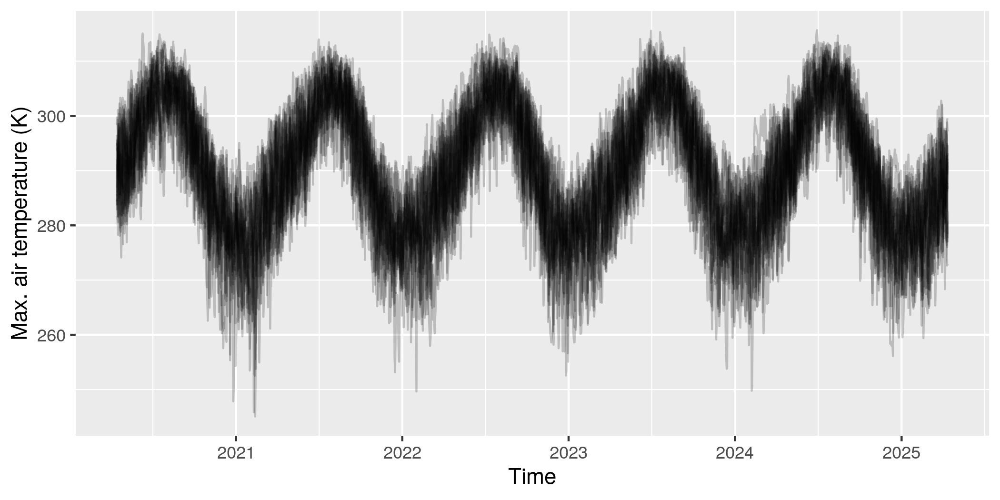
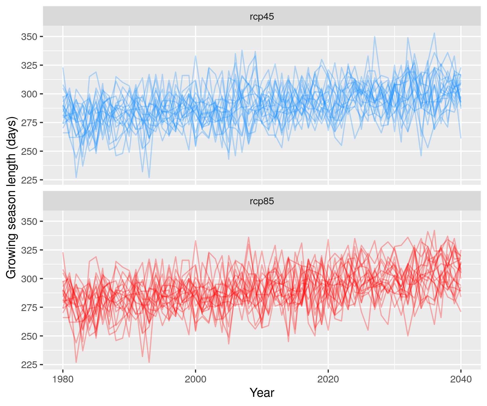
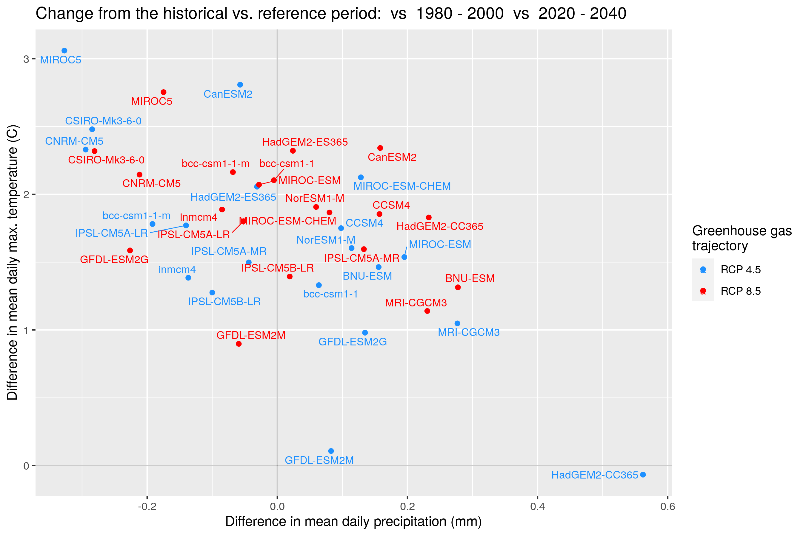

This vignette provides a walk-through of a common use case of the cft package:
understanding climate futures for a region of interest. 
We'll use Wind Cave National Park, located in South Dakota, USA as a case study.

### What you'll learn

This vignette will show you how to: 

- Access climate data for a spatial region of interest
- Produce a `data.frame` containing climate data
- Visualize historical and future data
- Generate and analyze new climate variables

### What you'll need

To get the most out of this vignette, we assume you have: 

- At least 500 MB of disk space
- Some familiarity with ggplot2
- Some familiarity with dplyr (e.g., `filter()`, `group_by()`, and `summarize()`)

## About the data

Global Circulation Models (GCMs) provide estimates of historical and future 
climate conditions. 
The complexity of the climate system has lead to a large number GCMs and it is
common practice to examine outputs from many different models, treating each as 
one plausible future.

Most GCMs are spatially coarse (often 1 degree), but downscaling provides finer
scale estimates. The cft package uses one downscaled climate model called MACA 
(Multivariate Adaptive Climate Analog) Version 2 
([details here](http://www.climatologylab.org/maca.html)).

### Acquiring and subsetting data within National Park Service boundaries

This package was originally written with the National Park Service in mind, so
it has the option to use the name of any park (or monument, preserve, etc.) within
the NPS. Use the `cftdata()` function to specify a range of years, a set of models,
a set of parameters, and a set of representative concentration pathways to return. 
Leaving these arguments empty will results in a download of all available data 
for that location.


```r
library(cft)
library(tibble)
library(ggplot2)
library(tidyr)
library(lubridate)
library(ggrepel)
library(dplyr)
```


```r
# Choose a project directory to store data
# (Leaving this argument empty will download data to a temporary directory)

proj_dir <- "~" 

# Create a Spatial* object for your area of interest
# (e.g., you could read a local shapefile here with readOGR)
aoi <- rgdal::readOGR(system.file("extdata", "windcave.geojson", package = "cft"))
#> OGR data source with driver: GeoJSON 
#> Source: "/home/max/R/x86_64-pc-linux-gnu-library/4.0/cft/extdata/windcave.geojson", layer: "windcave"
#> with 1 features
#> It has 19 fields

# download data
file_refs <- cftdata(aoi = aoi, 
                     area_name = "windcave",
                     years = c(2020, 2040),
                     local_dir = proj_dir,
                     parameters = c("tasmin", "tasmax", "uas", "vas", "pr"),
                     ncores = parallel::detectCores() / 2)
#> [1] "Building area of interest grid..."
#> [1] "Retrieving climate data for windcave"
#> [1] "Saving local files to /home/max/windcave"
```

The output of `cftdata` is a data.frame, where each row corresponds to one file:


```r
glimpse(file_refs)
#> Rows: 200
#> Columns: 13
#> $ local_file       <chr> "tasmin_windcave_bcc-csm1-1_r1i1p1_rcp45_macav2metda…
#> $ local_path       <chr> "/home/max/windcave/tasmin_windcave_bcc-csm1-1_r1i1p…
#> $ model            <chr> "bcc-csm1-1", "bcc-csm1-1", "bcc-csm1-1", "bcc-csm1-…
#> $ parameter        <chr> "tasmin", "tasmin", "tasmax", "tasmax", "uas", "uas"…
#> $ rcp              <chr> "rcp45", "rcp85", "rcp45", "rcp85", "rcp45", "rcp85"…
#> $ ensemble         <chr> "r1i1p1", "r1i1p1", "r1i1p1", "r1i1p1", "r1i1p1", "r…
#> $ year1            <dbl> 2020, 2020, 2020, 2020, 2020, 2020, 2020, 2020, 2020…
#> $ year2            <dbl> 2040, 2040, 2040, 2040, 2040, 2040, 2040, 2040, 2040…
#> $ area_name        <chr> "windcave", "windcave", "windcave", "windcave", "win…
#> $ units            <chr> "K", "K", "K", "K", "m s-1", "m s-1", "m s-1", "m s-…
#> $ full_varname     <chr> "Minimum Temperature", "Minimum Temperature", "Maxim…
#> $ internal_varname <chr> "air_temperature", "air_temperature", "air_temperatu…
#> $ parameter_long   <chr> "air_temperature", "air_temperature", "air_temperatu…
```

We can generate a data.frame of daily climate values averaged over the study 
region using the `cft_df()` function:


```r
df <- cft_df(file_refs, ncores = parallel::detectCores() / 2)
#> Computing spatial averages...
#> Generating climate data.frame...
```

This `df` is a tibble where each row represents a day by model by scenario 
combination, where the climate parameters of interest are represented as 
columns. Note that, in the output of `cft_df()`, average values represent all 2km by
2km grid cells that touch the Park boundary:


```r
glimpse(df)
#> Rows: 306,840
#> Columns: 10
#> $ rcp       <chr> "rcp45", "rcp85", "rcp45", "rcp85", "rcp45", "rcp85", "rcp4…
#> $ date      <date> 2020-01-01, 2020-01-01, 2020-01-01, 2020-01-01, 2020-01-01…
#> $ model     <chr> "bcc-csm1-1", "bcc-csm1-1", "bcc-csm1-1-m", "bcc-csm1-1-m",…
#> $ ensemble  <chr> "r1i1p1", "r1i1p1", "r1i1p1", "r1i1p1", "r1i1p1", "r1i1p1",…
#> $ area_name <chr> "windcave", "windcave", "windcave", "windcave", "windcave",…
#> $ tasmin    <dbl> 258.6535, 267.4921, 262.1381, 255.9822, 265.8079, 257.2419,…
#> $ tasmax    <dbl> 271.0576, 279.3801, 278.6900, 276.4950, 278.7834, 276.8796,…
#> $ uas       <dbl> 2.5145298, 4.0373213, -1.4234270, 2.9496087, 1.8698513, 3.2…
#> $ vas       <dbl> 0.41528416, 0.77429012, -1.48429512, 1.16956005, -4.5207128…
#> $ pr        <dbl> 0.00000000, 0.00000000, 1.73096346, 0.00000000, 0.02314971,…
```

We can work with this data frame to do some basic visualizations, like time 
series for a particular parameter. 
For example, we can use the `filter()` function from dplyr to focus on specific
date ranges and specific emissions scenarios. 


```r
df %>%
  filter(date > Sys.Date(), date < Sys.Date() + 365 * 5, # next 5 years
         rcp == "rcp85") %>%
  ggplot(aes(date, tasmax, group = model)) + 
  geom_line(alpha = .2) + 
  xlab("Time") + 
  ylab("Max. air temperature (K)")
```



### Computing new daily climate variables

Now that we have all of the climate parameters for our study region, we can
compute functions of those variables. 
For example, it is common to compute the midpoint of the maximum and minimum 
daily temperature, which we can do using the `mutate` function: 


```r
df <- df %>%
  mutate(tasmid = (tasmax + tasmin) / 2)
```

Now we have a new column called `tasmid` that is the midpoint of the maximum
and minumum daily temperature!

Wind speed provides another example of a derived parameter that can be computed 
for each day. 
By default, we have two wind-related parameters: the eastward wind component
(called `uas`) and the northward wind component (called `vas`), both in units of 
meters per second (you can get this information from `cft::argument_reference`). 
Wind speed can be computed from `vas` and `uas` using the Pythagorean theorem: 

$\text{Wind speed} = \sqrt{v_{as}^2 + u_{as}^2}.$

In code: 


```r
df <- df %>%
  mutate(wind_speed = sqrt(vas^2 + uas^2))
```

### Computing new climate variable summaries

Sometimes, there are new climate variables that summarize daily data. 
For example, you may want to compute: 

- Last Day of Frost (i.e., last day in spring when min. air temp. < 0 C)
- First Day of Frost (i.e., first day in fall when min. air temp. < 0 C)
- Number of days above or below some threshold (e.g., days with max. air temperature over 40 C, or days with > 1mm of precipitation)
- Growing season length (# days with air temperature > 0 C)

All of these quantities summarize daily data, and require some aggregation time interval which in many cases will be one year. 
As an example, we will compute the growing season length for Wind Cave National Park across all models and emissions scenarios. 
To do this, we first need to define a new column for year, which we will use as a grouping variable: 


```r
df <- df %>%
  mutate(year = year(date))
```

Now, we want to compute growing season length for each year, model, emissions scenario combination. 


```r
growing_seasons <- df %>%
  group_by(rcp, model, year, ensemble) %>%
  summarize(season_length = sum(tasmid > 273.15)) %>%
  ungroup
#> `summarise()` regrouping output by 'rcp', 'model', 'year' (override with `.groups` argument)
```

Notice that we used our derived temperature midpoint column `tasmid`, and computed the total (`sum()`) number of days for each group where the temperature midpoint was greater than 0 C (or, 273.15 Kelvin, which are the units of the temperature data).


```r
growing_seasons
#> # A tibble: 840 x 5
#>    rcp   model       year ensemble season_length
#>    <chr> <chr>      <dbl> <chr>            <int>
#>  1 rcp45 bcc-csm1-1  2020 r1i1p1             318
#>  2 rcp45 bcc-csm1-1  2021 r1i1p1             292
#>  3 rcp45 bcc-csm1-1  2022 r1i1p1             311
#>  4 rcp45 bcc-csm1-1  2023 r1i1p1             319
#>  5 rcp45 bcc-csm1-1  2024 r1i1p1             312
#>  6 rcp45 bcc-csm1-1  2025 r1i1p1             289
#>  7 rcp45 bcc-csm1-1  2026 r1i1p1             313
#>  8 rcp45 bcc-csm1-1  2027 r1i1p1             291
#>  9 rcp45 bcc-csm1-1  2028 r1i1p1             306
#> 10 rcp45 bcc-csm1-1  2029 r1i1p1             292
#> # … with 830 more rows
```

Let's visualize the growing season over time for each model and emission scenario:


```r
growing_seasons %>%
  ggplot(aes(year, season_length, color = rcp, group = model)) + 
  geom_line(alpha = .3) + 
  facet_wrap(~rcp, ncol = 1) + 
  xlab("Year") + 
  ylab("Growing season length (days)") + 
  scale_color_manual(values = c("dodgerblue", "red")) + 
  theme(legend.position = "none")
```




## Comparing climate in two time periods

Use the tibble object that is returned from `cft_df()` as an input to
`compare_periods()` to compare climate between a reference and target period. You
may specify the function with which to aggregate your chosen variable as well
as the yearly time period months of the year to include in this calculation.


```r
comps <- compare_periods(df,
                         var1 = "pr",
                         var2 = "tasmax",
                         agg_fun = "mean",
                         target_period = c(2025, 2030),
                         reference_period = c(2020, 2024),
                         months1 = 5:8,
                         months2 = 5:8,
                         scenarios = c("rcp45", "rcp85"))
```

This provides a data frame that can be used to compare the values in the target
and reference period.


```r
glimpse(comps)
#> Rows: 80
#> Columns: 9
#> Groups: rcp [2]
#> $ model            <chr> "bcc-csm1-1", "bcc-csm1-1-m", "BNU-ESM", "CanESM2", …
#> $ rcp              <chr> "rcp45", "rcp45", "rcp45", "rcp45", "rcp45", "rcp45"…
#> $ parameter        <chr> "pr", "pr", "pr", "pr", "pr", "pr", "pr", "pr", "pr"…
#> $ units            <chr> "mm", "mm", "mm", "mm", "mm", "mm", "mm", "mm", "mm"…
#> $ reference_period <chr> "2020 - 2024", "2020 - 2024", "2020 - 2024", "2020 -…
#> $ target_period    <chr> "2025 - 2030", "2025 - 2030", "2025 - 2030", "2025 -…
#> $ reference_value  <dbl> 2.400247, 1.900319, 2.677509, 2.223219, 2.477713, 2.…
#> $ target_value     <dbl> 2.365003, 2.386500, 2.439448, 2.354286, 2.618627, 1.…
#> $ difference       <dbl> -0.03524395, 0.48618144, -0.23806104, 0.13106647, 0.…
```

One useful plot shows the difference in the two variables between reference and
target periods:


```r
title <-  paste("Change from the historical vs. reference period:", 
                comps$reference_period, comps$target_period, sep= "  vs  " )[1]

comps %>%
  dplyr::select(parameter, rcp, model, reference_period, target_period, difference) %>%
  pivot_wider(names_from = parameter, values_from = difference) %>%
  ungroup %>%
  mutate(rcp = ifelse(rcp == "rcp45", "RCP 4.5", "RCP 8.5")) %>%
  ggplot(aes(pr, tasmax, color = rcp)) + 
  ggtitle(title) +
  geom_point() + 
  geom_hline(yintercept = 0, alpha = .2) + 
  geom_vline(xintercept = 0, alpha = .2) +
  geom_text_repel(aes(label = model), segment.size = .3, size = 3) + 
  xlab("Difference in mean daily precipitation (mm)") + 
  ylab("Difference in mean daily max. temperature (C)") + 
  scale_color_manual(values = c("dodgerblue", "red"), 
                     "Greenhouse gas\ntrajectory") 
```



So, nearly all model runs indicate warming, but the amount of warming varies by 
model and emissions scenario. 
Precipitation increases and decreases are predicted by different models. 

## Finding out which models and parameters are available

The cft package includes a reference object that can tell you what models, 
scenarios, and climate variables are available. 
You can use the reference object within to see the
available argument options for the `cftdata()` function: `models`, `parameters`,
and `scenarios` (as representative concentration pathways).
The `labels` field will spell out the specific meaning of each parameter, the
`variables` field shows the internal variable name of parameters in the data
sets  themselves, and the `units` field shows the measurement unit of each
variable.


```r
references <- cft::argument_reference
```

Here are the GCMs (the models):


```r
references$models
#>  [1] "bcc-csm1-1"     "bcc-csm1-1-m"   "BNU-ESM"        "CanESM2"       
#>  [5] "CCSM4"          "CNRM-CM5"       "CSIRO-Mk3-6-0"  "GFDL-ESM2M"    
#>  [9] "GFDL-ESM2G"     "HadGEM2-ES365"  "HadGEM2-CC365"  "inmcm4"        
#> [13] "IPSL-CM5A-LR"   "IPSL-CM5A-MR"   "IPSL-CM5B-LR"   "MIROC5"        
#> [17] "MIROC-ESM"      "MIROC-ESM-CHEM" "MRI-CGCM3"      "NorESM1-M"
```

Here are the emissions scenarios: 


```r
references$scenarios
#> [1] "rcp45" "rcp85"
```

And here are the climate parameters:


```r
references$parameters
#>  [1] "tasmin" "tasmax" "rhsmin" "rhsmax" "pr"     "rsds"   "uas"    "vas"   
#>  [9] "huss"   "vpd"
```

Labels for each acronym are also available, for example:


```r
references$labels["vpd"]
#> $vpd
#> [1] "Vapor Pressure Deficit"
references$labels["CCSM4"]
#> $CCSM4
#> [1] "Community Climate System Model 4"

# For hyphenated acronyms, use them either as objects or with backticks
model <- "IPSL-CM5A-MR"
references$labels[model]
#> $`IPSL-CM5A-MR`
#> [1] "Institut Pierre Simon Laplace (IPSL) - Climate Model 5A - Medium Resolution"
references$labels$`IPSL-CM5A-MR`  
#> [1] "Institut Pierre Simon Laplace (IPSL) - Climate Model 5A - Medium Resolution"
```

Not every model has the same set of parameters available, and the
`get_args` method lists model-specific information. 


```r
references$get_args("CCSM4")
#> $parameters
#> [1] "tasmin" "tasmax" "pr"     "rsds"   "uas"    "vas"    "huss"  
#> 
#> $scenarios
#> [1] "rcp45" "rcp85"
#> 
#> $ensemble
#> [1] "r6i1p1"
```


## Why write the cft package?

The amount of data generated by downscaled GCMs can be quite large
(e.g., daily data at a few km spatial resolution).
The Climate Futures Toolbox was developed to help users access and use 
smaller subsets. 

Data is acquired from the [Northwest Knowledge Server of the University of
Idaho](http://thredds.northwestknowledge.net:8080/thredds/reacch_climate_CMIP5_macav2_catalog2.html). 
