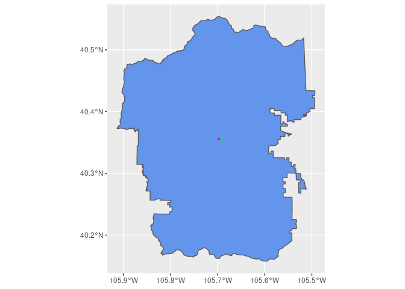

R Notebook
================

# Welcome to the Climate Futures Toolbox’s Firehose function

This vignette provides a walk-through of a common use case of the
Firehose function.

The purpose of the Firehose functions is to download the data as quickly
as possible by distributing tasks across multiple processors. The more
cores you use, the faster this process will go.

Note that the Firehose function is best used for downloading MACA
climate model data for multiple climate variables from multiple climate
models and emission scenarios in their entirety for a **single lat/long
location**. If you want to download data about multiple variables from
multiple models and emission scenarios over a larger geographic region
and a shorter time period, you should use the available_data function. A
vignette about how to use the available_data function is available at
<https://github.com/earthlab/cft/blob/main/vignettes/available-data.md>.

Load the cft package. If you need to install cft, see the main cft
tutorial on our github page for instructions.

# Loading the cft package from github

``` r
library(devtools)
install_github("earthlab/cft")
```

``` r
library(cft)
```

We will start by setting up our computer to run code on multiple cores
instead of just one. The availableCores() function first checks your
local computer to see how many cores are available and then subtracts
one so that you still have an available core for running your operating
system. The plan() function then starts a back-end structure where tasks
can be assigned. **These backend systems can sometimes have difficulty
shutting down after the process is done, especially if you force quite
an operation in the works. If you find your code stalling without good
explanation, it’s good to restart your computer to clear any of these
structures that may be stuck in memory.**

``` r
n_cores <- availableCores() - 1
plan(multiprocess, workers = n_cores)
```

We pull all of our data from the internet. Since internet connections
can be a little variable, we try to make a strong link between our
computer and the data server by creating an src object. Run this code to
establish the connection and then use the src object you created to call
on that connection for information. Because this src object is a
connection, it will need to be reconnected each time you want to use it.
You cannot make it once and then use if forever.

``` r
web_link = "https://cida.usgs.gov/thredds/dodsC/macav2metdata_daily_future"

# Change to "https://cida.usgs.gov/thredds/catalog.html?dataset=cida.usgs.gov/macav2metdata_daily_historical" for historical data. 

src <- tidync::tidync(web_link)
```

    ## not a file: 
    ## ' https://cida.usgs.gov/thredds/dodsC/macav2metdata_daily_future '
    ## 
    ## ... attempting remote connection

    ## Connection succeeded.

After a connection is made to the server, we can run the
available_data() function to check that server and see what data it has
available to us. The available_data() function produces three outputs:

1.  a raw list of available data
2.  a table of date times available
3.  a table summarizing available variables and the attributes of those
    variables

Here we print that list of variables. This may take up to a minutes as
you retrieve the information from the server.

``` r
# This is your menu
inputs <- cft::available_data()
```

    ## Trying to connect to the USGS.gov API

    ## not a file: 
    ## ' https://cida.usgs.gov/thredds/dodsC/macav2metdata_daily_future '
    ## 
    ## ... attempting remote connection

    ## Connection succeeded.

    ## Reading results

    ## Converting into an R data.table

``` r
inputs[[1]]
```

    ## # A tibble: 350 × 9
    ##    `Available variable`           Variable Units Model `Model ensembl…` Scenario
    ##    <chr>                          <chr>    <chr> <chr> <chr>            <chr>   
    ##  1 huss_BNU-ESM_r1i1p1_rcp45      Specifi… kg k… Beij… r1i1p1           RCP 4.5 
    ##  2 huss_BNU-ESM_r1i1p1_rcp85      Specifi… kg k… Beij… r1i1p1           RCP 8.5 
    ##  3 huss_CCSM4_r6i1p1_rcp45        Specifi… kg k… Comm… r6i1p1           RCP 4.5 
    ##  4 huss_CCSM4_r6i1p1_rcp85        Specifi… kg k… Comm… r6i1p1           RCP 8.5 
    ##  5 huss_CNRM-CM5_r1i1p1_rcp45     Specifi… kg k… Cent… r1i1p1           RCP 4.5 
    ##  6 huss_CNRM-CM5_r1i1p1_rcp85     Specifi… kg k… Cent… r1i1p1           RCP 8.5 
    ##  7 huss_CSIRO-Mk3-6-0_r1i1p1_rcp… Specifi… kg k… Comm… r1i1p1           RCP 4.5 
    ##  8 huss_CSIRO-Mk3-6-0_r1i1p1_rcp… Specifi… kg k… Comm… r1i1p1           RCP 8.5 
    ##  9 huss_CanESM2_r1i1p1_rcp45      Specifi… kg k… Cana… r1i1p1           RCP 4.5 
    ## 10 huss_CanESM2_r1i1p1_rcp85      Specifi… kg k… Cana… r1i1p1           RCP 8.5 
    ## # … with 340 more rows, and 3 more variables: `Variable abbreviation` <chr>,
    ## #   `Model abbreviation` <chr>, `Scenario abbreviation` <chr>

From the table that was returned, we want to decide which variables we
would like to request. If you are using the Firehose function, you
likely have a long list of variables you’d like to download in their
entirety. Use the
[filter()](https://www.rdocumentation.org/packages/dplyr/versions/0.7.8/topics/filter)
function to select the variables you’d like to download. Store those
choices in an object called input_variables to pass on to the Firehose
function.

``` r
input_variables <- inputs$variable_names %>% 
  filter(Variable %in% c("Maximum Relative Humidity", 
                       "Maximum Temperature", 
                       "Minimum Relative Humidity",          
                       "Minimum Temperature",                 
                       "Precipitation")) %>% 
  filter(Scenario %in% c( "RCP 8.5", "RCP 4.5")) %>% 
  filter(Model %in% c(
    "Beijing Climate Center - Climate System Model 1.1",
    "Beijing Normal University - Earth System Model",
    "Canadian Earth System Model 2",                                                                
  "Centre National de Recherches Météorologiques - Climate Model 5",                              
  "Commonwealth Scientific and Industrial Research Organisation - Mk3.6.0",                       
  "Community Climate System Model 4",                                                             
  "Geophysical Fluid Dynamics Laboratory - Earth System Model 2 Generalized Ocean Layer Dynamics",
  "Geophysical Fluid Dynamics Laboratory - Earth System Model 2 Modular Ocean",                   
  "Hadley Global Environment Model 2 - Climate Chemistry 365 (day) ",                             
 "Hadley Global Environment Model 2 - Earth System 365 (day)",                                   
 "Institut Pierre Simon Laplace (IPSL) - Climate Model 5A - Low Resolution",                     
 "Institut Pierre Simon Laplace (IPSL) - Climate Model 5A - Medium Resolution",                  
 "Institut Pierre Simon Laplace (IPSL) - Climate Model 5B - Low Resolution",                     
 "Institute of Numerical Mathematics Climate Model 4",                                           
 "Meteorological Research Institute - Coupled Global Climate Model 3",                           
 "Model for Interdisciplinary Research On Climate - Earth System Model",                         
 "Model for Interdisciplinary Research On Climate - Earth System Model - Chemistry",             
 "Model for Interdisciplinary Research On Climate 5",                                            
 "Norwegian Earth System Model 1 - Medium Resolution"  )) %>%
  
  pull("Available variable")
```

You can check the object you created to see that it is a list of
formatted variable names ready to send to the server.

``` r
# This is the list of things you would like to order off the menu
input_variables
```

    ##   [1] "pr_BNU-ESM_r1i1p1_rcp45"            "pr_BNU-ESM_r1i1p1_rcp85"           
    ##   [3] "pr_CCSM4_r6i1p1_rcp45"              "pr_CCSM4_r6i1p1_rcp85"             
    ##   [5] "pr_CNRM-CM5_r1i1p1_rcp45"           "pr_CNRM-CM5_r1i1p1_rcp85"          
    ##   [7] "pr_CSIRO-Mk3-6-0_r1i1p1_rcp45"      "pr_CSIRO-Mk3-6-0_r1i1p1_rcp85"     
    ##   [9] "pr_CanESM2_r1i1p1_rcp45"            "pr_CanESM2_r1i1p1_rcp85"           
    ##  [11] "pr_GFDL-ESM2G_r1i1p1_rcp45"         "pr_GFDL-ESM2G_r1i1p1_rcp85"        
    ##  [13] "pr_GFDL-ESM2M_r1i1p1_rcp45"         "pr_GFDL-ESM2M_r1i1p1_rcp85"        
    ##  [15] "pr_HadGEM2-CC365_r1i1p1_rcp45"      "pr_HadGEM2-CC365_r1i1p1_rcp85"     
    ##  [17] "pr_HadGEM2-ES365_r1i1p1_rcp45"      "pr_HadGEM2-ES365_r1i1p1_rcp85"     
    ##  [19] "pr_IPSL-CM5A-LR_r1i1p1_rcp45"       "pr_IPSL-CM5A-LR_r1i1p1_rcp85"      
    ##  [21] "pr_IPSL-CM5A-MR_r1i1p1_rcp45"       "pr_IPSL-CM5A-MR_r1i1p1_rcp85"      
    ##  [23] "pr_IPSL-CM5B-LR_r1i1p1_rcp45"       "pr_IPSL-CM5B-LR_r1i1p1_rcp85"      
    ##  [25] "pr_MIROC-ESM-CHEM_r1i1p1_rcp45"     "pr_MIROC-ESM-CHEM_r1i1p1_rcp85"    
    ##  [27] "pr_MIROC-ESM_r1i1p1_rcp85"          "pr_MIROC-ESM_r1i1p1_rcp45"         
    ##  [29] "pr_MIROC5_r1i1p1_rcp45"             "pr_MIROC5_r1i1p1_rcp85"            
    ##  [31] "pr_MRI-CGCM3_r1i1p1_rcp45"          "pr_MRI-CGCM3_r1i1p1_rcp85"         
    ##  [33] "pr_NorESM1-M_r1i1p1_rcp45"          "pr_NorESM1-M_r1i1p1_rcp85"         
    ##  [35] "pr_bcc-csm1-1_r1i1p1_rcp45"         "pr_bcc-csm1-1_r1i1p1_rcp85"        
    ##  [37] "pr_inmcm4_r1i1p1_rcp45"             "pr_inmcm4_r1i1p1_rcp85"            
    ##  [39] "rhsmax_BNU-ESM_r1i1p1_rcp45"        "rhsmax_BNU-ESM_r1i1p1_rcp85"       
    ##  [41] "rhsmax_CNRM-CM5_r1i1p1_rcp45"       "rhsmax_CNRM-CM5_r1i1p1_rcp85"      
    ##  [43] "rhsmax_CSIRO-Mk3-6-0_r1i1p1_rcp45"  "rhsmax_CSIRO-Mk3-6-0_r1i1p1_rcp85" 
    ##  [45] "rhsmax_CanESM2_r1i1p1_rcp45"        "rhsmax_CanESM2_r1i1p1_rcp85"       
    ##  [47] "rhsmax_GFDL-ESM2G_r1i1p1_rcp45"     "rhsmax_GFDL-ESM2G_r1i1p1_rcp85"    
    ##  [49] "rhsmax_GFDL-ESM2M_r1i1p1_rcp45"     "rhsmax_HadGEM2-CC365_r1i1p1_rcp45" 
    ##  [51] "rhsmax_HadGEM2-CC365_r1i1p1_rcp85"  "rhsmax_HadGEM2-ES365_r1i1p1_rcp45" 
    ##  [53] "rhsmax_HadGEM2-ES365_r1i1p1_rcp85"  "rhsmax_IPSL-CM5A-LR_r1i1p1_rcp45"  
    ##  [55] "rhsmax_IPSL-CM5A-LR_r1i1p1_rcp85"   "rhsmax_IPSL-CM5A-MR_r1i1p1_rcp45"  
    ##  [57] "rhsmax_IPSL-CM5A-MR_r1i1p1_rcp85"   "rhsmax_IPSL-CM5B-LR_r1i1p1_rcp45"  
    ##  [59] "rhsmax_IPSL-CM5B-LR_r1i1p1_rcp85"   "rhsmax_MIROC-ESM-CHEM_r1i1p1_rcp45"
    ##  [61] "rhsmax_MIROC-ESM-CHEM_r1i1p1_rcp85" "rhsmax_MIROC-ESM_r1i1p1_rcp45"     
    ##  [63] "rhsmax_MIROC-ESM_r1i1p1_rcp85"      "rhsmax_MIROC5_r1i1p1_rcp45"        
    ##  [65] "rhsmax_MIROC5_r1i1p1_rcp85"         "rhsmax_MRI-CGCM3_r1i1p1_rcp45"     
    ##  [67] "rhsmax_MRI-CGCM3_r1i1p1_rcp85"      "rhsmax_bcc-csm1-1_r1i1p1_rcp45"    
    ##  [69] "rhsmax_bcc-csm1-1_r1i1p1_rcp85"     "rhsmax_inmcm4_r1i1p1_rcp45"        
    ##  [71] "rhsmax_inmcm4_r1i1p1_rcp85"         "rhsmin_BNU-ESM_r1i1p1_rcp45"       
    ##  [73] "rhsmin_BNU-ESM_r1i1p1_rcp85"        "rhsmin_CNRM-CM5_r1i1p1_rcp45"      
    ##  [75] "rhsmin_CNRM-CM5_r1i1p1_rcp85"       "rhsmin_CSIRO-Mk3-6-0_r1i1p1_rcp45" 
    ##  [77] "rhsmin_CSIRO-Mk3-6-0_r1i1p1_rcp85"  "rhsmin_CanESM2_r1i1p1_rcp45"       
    ##  [79] "rhsmin_CanESM2_r1i1p1_rcp85"        "rhsmin_GFDL-ESM2G_r1i1p1_rcp45"    
    ##  [81] "rhsmin_GFDL-ESM2G_r1i1p1_rcp85"     "rhsmin_GFDL-ESM2M_r1i1p1_rcp45"    
    ##  [83] "rhsmin_GFDL-ESM2M_r1i1p1_rcp85"     "rhsmin_HadGEM2-CC365_r1i1p1_rcp45" 
    ##  [85] "rhsmin_HadGEM2-CC365_r1i1p1_rcp85"  "rhsmin_HadGEM2-ES365_r1i1p1_rcp45" 
    ##  [87] "rhsmin_HadGEM2-ES365_r1i1p1_rcp85"  "rhsmin_IPSL-CM5A-LR_r1i1p1_rcp45"  
    ##  [89] "rhsmin_IPSL-CM5A-LR_r1i1p1_rcp85"   "rhsmin_IPSL-CM5A-MR_r1i1p1_rcp45"  
    ##  [91] "rhsmin_IPSL-CM5A-MR_r1i1p1_rcp85"   "rhsmin_IPSL-CM5B-LR_r1i1p1_rcp45"  
    ##  [93] "rhsmin_IPSL-CM5B-LR_r1i1p1_rcp85"   "rhsmin_MIROC-ESM-CHEM_r1i1p1_rcp45"
    ##  [95] "rhsmin_MIROC-ESM-CHEM_r1i1p1_rcp85" "rhsmin_MIROC-ESM_r1i1p1_rcp45"     
    ##  [97] "rhsmin_MIROC-ESM_r1i1p1_rcp85"      "rhsmin_MIROC5_r1i1p1_rcp45"        
    ##  [99] "rhsmin_MIROC5_r1i1p1_rcp85"         "rhsmin_MRI-CGCM3_r1i1p1_rcp45"     
    ## [101] "rhsmin_MRI-CGCM3_r1i1p1_rcp85"      "rhsmin_bcc-csm1-1_r1i1p1_rcp45"    
    ## [103] "rhsmin_bcc-csm1-1_r1i1p1_rcp85"     "rhsmin_inmcm4_r1i1p1_rcp45"        
    ## [105] "rhsmin_inmcm4_r1i1p1_rcp85"         "tasmax_BNU-ESM_r1i1p1_rcp45"       
    ## [107] "tasmax_BNU-ESM_r1i1p1_rcp85"        "tasmax_CCSM4_r6i1p1_rcp45"         
    ## [109] "tasmax_CCSM4_r6i1p1_rcp85"          "tasmax_CNRM-CM5_r1i1p1_rcp45"      
    ## [111] "tasmax_CNRM-CM5_r1i1p1_rcp85"       "tasmax_CSIRO-Mk3-6-0_r1i1p1_rcp45" 
    ## [113] "tasmax_CSIRO-Mk3-6-0_r1i1p1_rcp85"  "tasmax_CanESM2_r1i1p1_rcp45"       
    ## [115] "tasmax_CanESM2_r1i1p1_rcp85"        "tasmax_GFDL-ESM2G_r1i1p1_rcp45"    
    ## [117] "tasmax_GFDL-ESM2G_r1i1p1_rcp85"     "tasmax_GFDL-ESM2M_r1i1p1_rcp45"    
    ## [119] "tasmax_GFDL-ESM2M_r1i1p1_rcp85"     "tasmax_HadGEM2-CC365_r1i1p1_rcp45" 
    ## [121] "tasmax_HadGEM2-CC365_r1i1p1_rcp85"  "tasmax_HadGEM2-ES365_r1i1p1_rcp45" 
    ## [123] "tasmax_HadGEM2-ES365_r1i1p1_rcp85"  "tasmax_IPSL-CM5A-LR_r1i1p1_rcp45"  
    ## [125] "tasmax_IPSL-CM5A-LR_r1i1p1_rcp85"   "tasmax_IPSL-CM5A-MR_r1i1p1_rcp45"  
    ## [127] "tasmax_IPSL-CM5A-MR_r1i1p1_rcp85"   "tasmax_IPSL-CM5B-LR_r1i1p1_rcp45"  
    ## [129] "tasmax_IPSL-CM5B-LR_r1i1p1_rcp85"   "tasmax_MIROC-ESM-CHEM_r1i1p1_rcp45"
    ## [131] "tasmax_MIROC-ESM-CHEM_r1i1p1_rcp85" "tasmax_MIROC-ESM_r1i1p1_rcp45"     
    ## [133] "tasmax_MIROC-ESM_r1i1p1_rcp85"      "tasmax_MIROC5_r1i1p1_rcp45"        
    ## [135] "tasmax_MIROC5_r1i1p1_rcp85"         "tasmax_MRI-CGCM3_r1i1p1_rcp45"     
    ## [137] "tasmax_MRI-CGCM3_r1i1p1_rcp85"      "tasmax_NorESM1-M_r1i1p1_rcp45"     
    ## [139] "tasmax_NorESM1-M_r1i1p1_rcp85"      "tasmax_bcc-csm1-1_r1i1p1_rcp45"    
    ## [141] "tasmax_bcc-csm1-1_r1i1p1_rcp85"     "tasmax_inmcm4_r1i1p1_rcp45"        
    ## [143] "tasmax_inmcm4_r1i1p1_rcp85"         "tasmin_BNU-ESM_r1i1p1_rcp45"       
    ## [145] "tasmin_BNU-ESM_r1i1p1_rcp85"        "tasmin_CCSM4_r6i1p1_rcp45"         
    ## [147] "tasmin_CCSM4_r6i1p1_rcp85"          "tasmin_CNRM-CM5_r1i1p1_rcp45"      
    ## [149] "tasmin_CNRM-CM5_r1i1p1_rcp85"       "tasmin_CSIRO-Mk3-6-0_r1i1p1_rcp45" 
    ## [151] "tasmin_CSIRO-Mk3-6-0_r1i1p1_rcp85"  "tasmin_CanESM2_r1i1p1_rcp45"       
    ## [153] "tasmin_CanESM2_r1i1p1_rcp85"        "tasmin_GFDL-ESM2G_r1i1p1_rcp45"    
    ## [155] "tasmin_GFDL-ESM2G_r1i1p1_rcp85"     "tasmin_GFDL-ESM2M_r1i1p1_rcp45"    
    ## [157] "tasmin_GFDL-ESM2M_r1i1p1_rcp85"     "tasmin_HadGEM2-CC365_r1i1p1_rcp45" 
    ## [159] "tasmin_HadGEM2-CC365_r1i1p1_rcp85"  "tasmin_HadGEM2-ES365_r1i1p1_rcp45" 
    ## [161] "tasmin_HadGEM2-ES365_r1i1p1_rcp85"  "tasmin_IPSL-CM5A-LR_r1i1p1_rcp45"  
    ## [163] "tasmin_IPSL-CM5A-LR_r1i1p1_rcp85"   "tasmin_IPSL-CM5A-MR_r1i1p1_rcp45"  
    ## [165] "tasmin_IPSL-CM5A-MR_r1i1p1_rcp85"   "tasmin_IPSL-CM5B-LR_r1i1p1_rcp45"  
    ## [167] "tasmin_IPSL-CM5B-LR_r1i1p1_rcp85"   "tasmin_MIROC-ESM-CHEM_r1i1p1_rcp45"
    ## [169] "tasmin_MIROC-ESM-CHEM_r1i1p1_rcp85" "tasmin_MIROC-ESM_r1i1p1_rcp45"     
    ## [171] "tasmin_MIROC-ESM_r1i1p1_rcp85"      "tasmin_MIROC5_r1i1p1_rcp45"        
    ## [173] "tasmin_MIROC5_r1i1p1_rcp85"         "tasmin_MRI-CGCM3_r1i1p1_rcp45"     
    ## [175] "tasmin_MRI-CGCM3_r1i1p1_rcp85"      "tasmin_NorESM1-M_r1i1p1_rcp45"     
    ## [177] "tasmin_NorESM1-M_r1i1p1_rcp85"      "tasmin_bcc-csm1-1_r1i1p1_rcp45"    
    ## [179] "tasmin_bcc-csm1-1_r1i1p1_rcp85"     "tasmin_inmcm4_r1i1p1_rcp45"        
    ## [181] "tasmin_inmcm4_r1i1p1_rcp85"

# Set your area of interest

The Firehose function downloads all the requested variables, for all
available time points, for a SINGLE geographic location. The underlying
data are summarized to points on a grid and don’t include every
conceivable point you could enter. You need to first suggest a lat/long
pair and then find the aggregated download point that is closest to your
suggested point. In the code here, we use Open Street Map to download a
polygon for Rocky Mountain National Park and then find the centroid as
our suggested point.

``` r
aoi_name <- "colorado"
bb <- getbb(aoi_name)
my_boundary <- opq(bb) %>%
  add_osm_feature(key = "boundary", value = "national_park") %>%
  osmdata_sf()

my_boundary
my_boundary$osm_multipolygons
```

    ## Simple feature collection with 20 features and 41 fields
    ## Geometry type: MULTIPOLYGON
    ## Dimension:     XY
    ## Bounding box:  xmin: -111.8848 ymin: 36.28472 xmax: -101.6277 ymax: 40.74693
    ## Geodetic CRS:  WGS 84
    ## First 10 features:
    ##          osm_id                                       name
    ## 390960   390960               Rocky Mountain National Park
    ## 395552   395552 Black Canyon of the Gunnison National Park
    ## 395555   395555         Curecanti National Recreation Area
    ## 396142   396142                Comanche National Grassland
    ## 396404   396404                   San Juan National Forest
    ## 5271284 5271284               Manti-La Sal National Forest
    ## 5435635 5435635                 Grand Mesa National Forest
    ## 5453168 5453168                 Colorado National Monument
    ## 5725308 5725308             Great Sand Dunes National Park
    ## 5725309 5725309         Great Sand Dunes National Preserve
    ##                   attribution      boundary  boundary.type  ele gnis.county_id
    ## 390960  National Park Service national_park protected_area                    
    ## 395552  National Park Service national_park                2045            085
    ## 395555  National Park Service national_park protected_area                    
    ## 396142      US Forest Service national_park protected_area                    
    ## 396404      US Forest Service national_park protected_area                    
    ## 5271284                       national_park protected_area                    
    ## 5435635                       national_park protected_area                 077
    ## 5453168                       national_park                                   
    ## 5725308 National Park Service national_park protected_area 2590            109
    ## 5725309 National Park Service national_park protected_area                    
    ##         gnis.created gnis.feature_id gnis.state_id heritage heritage.operator
    ## 390960                                                                       
    ## 395552    10/13/1978          203271            08                           
    ## 395555                                                                       
    ## 396142                                                                       
    ## 396404                                                                       
    ## 5271284                                                                      
    ## 5435635   10/13/1978          169573            08                           
    ## 5453168                                                                      
    ## 5725308   08/31/1992          192558            08                           
    ## 5725309                                                                      
    ##                leisure name.ar name.en name.es name.fr name.ja name.nl name.ru
    ## 390960                                                                        
    ## 395552  nature_reserve                                                        
    ## 395555  nature_reserve                                                        
    ## 396142  nature_reserve                                                        
    ## 396404                                                                        
    ## 5271284                                                                       
    ## 5435635                                                                       
    ## 5453168 nature_reserve                                                        
    ## 5725308 nature_reserve                                                        
    ## 5725309 nature_reserve                                                        
    ##         name.zh                            operator operator.short
    ## 390960                        National Park Service            NPS
    ## 395552          United States National Park Service               
    ## 395555                                                            
    ## 396142                            US Forest Service               
    ## 396404                 United States Forest Service               
    ## 5271284                United States Forest Service               
    ## 5435635                United States Forest Service               
    ## 5453168                                                           
    ## 5725308                       National Park Service            NPS
    ## 5725309                       National Park Service            NPS
    ##         operator.type operator.wikidata       operator.wikipedia ownership
    ## 390960         public           Q308439 en:National Park Service  national
    ## 395552                                                            national
    ## 395555                                                            national
    ## 396142                                                                    
    ## 396404                                                            national
    ## 5271284                                                           national
    ## 5435635                                                           national
    ## 5453168                                                           national
    ## 5725308        public           Q308439 en:National Park Service  national
    ## 5725309        public           Q308439 en:National Park Service  national
    ##         protect_class protect_id protect_title  protected
    ## 390960              2          2 National Park perpetuity
    ## 395552                         2               perpetuity
    ## 395555              5                                    
    ## 396142              6                                    
    ## 396404              6                          perpetuity
    ## 5271284             6                          perpetuity
    ## 5435635             6                          perpetuity
    ## 5453168             3                          perpetuity
    ## 5725308                        2               perpetuity
    ## 5725309                        2               perpetuity
    ##                 protection_title ref.whc
    ## 390960             National Park        
    ## 395552             National Park        
    ## 395555  National Recreation Area        
    ## 396142                                  
    ## 396404           National Forest        
    ## 5271284          National Forest        
    ## 5435635          National Forest        
    ## 5453168        National Monument        
    ## 5725308            National Park        
    ## 5725309        National Preserve        
    ##                                                                  source
    ## 390960                                                                 
    ## 395552                                                                 
    ## 395555                   http://science.nature.nps.gov/im/gis/index.cfm
    ## 396142                                                                 
    ## 396404                                                                 
    ## 5271284                                http://data.fs.usda.gov/geodata/
    ## 5435635                                http://data.fs.usda.gov/geodata/
    ## 5453168 http://science.nature.nps.gov/im/gis/index.cfm;en.wikipedia.org
    ## 5725308                                                                
    ## 5725309                                                                
    ##         source.geometry         type                            website
    ## 390960                      boundary           http://www.nps.gov/romo/
    ## 395552                      boundary                                   
    ## 395555                      boundary                                   
    ## 396142                      boundary                                   
    ## 396404                  multipolygon                                   
    ## 5271284                 multipolygon                                   
    ## 5435635                     boundary                                   
    ## 5453168                     boundary https://www.nps.gov/colm/index.htm
    ## 5725308                     boundary                                   
    ## 5725309                     boundary                                   
    ##         whc.criteria whc.inscription_date wikidata
    ## 390960                                     Q777183
    ## 395552                                     Q305880
    ## 395555                                            
    ## 396142                                    Q5150518
    ## 396404                                     Q643618
    ## 5271284                                           
    ## 5435635                                           
    ## 5453168                                   Q1111312
    ## 5725308                                    Q609097
    ## 5725309                                    Q609097
    ##                                              wikipedia
    ## 390960                 en:Rocky Mountain National Park
    ## 395552   en:Black Canyon of the Gunnison National Park
    ## 395555                                                
    ## 396142                                                
    ## 396404                     en:San Juan National Forest
    ## 5271284                                               
    ## 5435635                                               
    ## 5453168                  en:Colorado National Monument
    ## 5725308 en:Great Sand Dunes National Park and Preserve
    ## 5725309 en:Great Sand Dunes National Park and Preserve
    ##                               geometry
    ## 390960  MULTIPOLYGON (((-105.7615 4...
    ## 395552  MULTIPOLYGON (((-107.8019 3...
    ## 395555  MULTIPOLYGON (((-107.6507 3...
    ## 396142  MULTIPOLYGON (((-103.5433 3...
    ## 396404  MULTIPOLYGON (((-106.6784 3...
    ## 5271284 MULTIPOLYGON (((-109.8207 3...
    ## 5435635 MULTIPOLYGON (((-108.7327 3...
    ## 5453168 MULTIPOLYGON (((-108.7384 3...
    ## 5725308 MULTIPOLYGON (((-105.517 37...
    ## 5725309 MULTIPOLYGON (((-105.5522 3...

``` r
my_boundary$osm_multipolygons[1,]
```

    ## Simple feature collection with 1 feature and 41 fields
    ## Geometry type: MULTIPOLYGON
    ## Dimension:     XY
    ## Bounding box:  xmin: -105.9137 ymin: 40.15777 xmax: -105.4936 ymax: 40.55379
    ## Geodetic CRS:  WGS 84
    ##        osm_id                         name           attribution      boundary
    ## 390960 390960 Rocky Mountain National Park National Park Service national_park
    ##         boundary.type ele gnis.county_id gnis.created gnis.feature_id
    ## 390960 protected_area                                                
    ##        gnis.state_id heritage heritage.operator leisure name.ar name.en name.es
    ## 390960                                                                         
    ##        name.fr name.ja name.nl name.ru name.zh              operator
    ## 390960                                         National Park Service
    ##        operator.short operator.type operator.wikidata       operator.wikipedia
    ## 390960            NPS        public           Q308439 en:National Park Service
    ##        ownership protect_class protect_id protect_title  protected
    ## 390960  national             2          2 National Park perpetuity
    ##        protection_title ref.whc source source.geometry     type
    ## 390960    National Park                                boundary
    ##                         website whc.criteria whc.inscription_date wikidata
    ## 390960 http://www.nps.gov/romo/                                    Q777183
    ##                              wikipedia                       geometry
    ## 390960 en:Rocky Mountain National Park MULTIPOLYGON (((-105.7615 4...

``` r
boundaries <- my_boundary$osm_multipolygons[1,] 
```

``` r
ggplot() +
  geom_sf(data = boundaries, fill = "cornflowerblue") 
```

    ## Warning in CPL_transform(x, crs, aoi, pipeline, reverse, desired_accuracy, :
    ## GDAL Error 1: PROJ: proj_as_wkt: DatumEnsemble can only be exported to WKT2:2019

    ## Warning in CPL_transform(x, crs, aoi, pipeline, reverse, desired_accuracy, :
    ## GDAL Error 1: PROJ: proj_as_wkt: DatumEnsemble can only be exported to WKT2:2019

    ## Warning in CPL_transform(x, crs, aoi, pipeline, reverse, desired_accuracy, :
    ## GDAL Error 1: PROJ: proj_as_wkt: DatumEnsemble can only be exported to WKT2:2019

    ## Warning in CPL_transform(x, crs, aoi, pipeline, reverse, desired_accuracy, :
    ## GDAL Error 1: PROJ: proj_as_wkt: DatumEnsemble can only be exported to WKT2:2019

<!-- -->

``` r
pulled_bb <-  st_bbox(boundaries)
pulled_bb
```

    ##       xmin       ymin       xmax       ymax 
    ## -105.91371   40.15777 -105.49358   40.55379

``` r
pt <- st_coordinates(st_centroid(boundaries))
```

    ## Warning in st_centroid.sf(boundaries): st_centroid assumes attributes are
    ## constant over geometries of x

So, our suggested point is pt.

``` r
pt
```

    ##           X        Y
    ## 1 -105.6973 40.35543

Now we can check to see which point in the dataset most closely
resembles our suggested point.

``` r
lat_pt <- pt[1,2]
lon_pt <- pt[1,1]

lons <- src %>% activate("D2") %>% hyper_tibble()
lats <- src %>% activate("D1") %>% hyper_tibble()

known_lon <- lons[which(abs(lons-lon_pt)==min(abs(lons-lon_pt))),]
known_lat <- lats[which(abs(lats-lat_pt)==min(abs(lats-lat_pt))),]


chosen_pt <- st_as_sf(cbind(known_lon,known_lat), coords = c("lon", "lat"), crs = "WGS84", agr = "constant")
```

The chosen point is relatively close to the suggested point.

``` r
chosen_pt
```

    ## Simple feature collection with 1 feature and 0 fields
    ## Geometry type: POINT
    ## Dimension:     XY
    ## Bounding box:  xmin: -105.6891 ymin: 40.3545 xmax: -105.6891 ymax: 40.3545
    ## Geodetic CRS:  WGS 84
    ##                    geometry
    ## 1 POINT (-105.6891 40.3545)

A plot of the suggested point and the available point next to eachother
for perspective. You can see that there is an available data slice very
near our suggested point.

``` r
ggplot() +
  geom_sf(data = boundaries, fill = "cornflowerblue") +
  geom_sf(data = st_centroid(boundaries), color = "red", size=0.5) +
  geom_sf(data = chosen_pt, color = "green", size=0.5)
```

    ## Warning in st_centroid.sf(boundaries): st_centroid assumes attributes are
    ## constant over geometries of x

    ## Warning in CPL_transform(x, crs, aoi, pipeline, reverse, desired_accuracy, :
    ## GDAL Error 1: PROJ: proj_as_wkt: DatumEnsemble can only be exported to WKT2:2019

    ## Warning in CPL_transform(x, crs, aoi, pipeline, reverse, desired_accuracy, :
    ## GDAL Error 1: PROJ: proj_as_wkt: DatumEnsemble can only be exported to WKT2:2019

    ## Warning in CPL_transform(x, crs, aoi, pipeline, reverse, desired_accuracy, :
    ## GDAL Error 1: PROJ: proj_as_wkt: DatumEnsemble can only be exported to WKT2:2019

    ## Warning in CPL_transform(x, crs, aoi, pipeline, reverse, desired_accuracy, :
    ## GDAL Error 1: PROJ: proj_as_wkt: DatumEnsemble can only be exported to WKT2:2019

    ## Warning in CPL_transform(x, crs, aoi, pipeline, reverse, desired_accuracy, :
    ## GDAL Error 1: PROJ: proj_as_wkt: DatumEnsemble can only be exported to WKT2:2019

    ## Warning in CPL_transform(x, crs, aoi, pipeline, reverse, desired_accuracy, :
    ## GDAL Error 1: PROJ: proj_as_wkt: DatumEnsemble can only be exported to WKT2:2019

    ## Warning in CPL_transform(x, crs, aoi, pipeline, reverse, desired_accuracy, :
    ## GDAL Error 1: PROJ: proj_as_wkt: DatumEnsemble can only be exported to WKT2:2019

<!-- -->

# Run the Firehose function

You will need to supply the Firehose function with three things for it
to work properly:

1.  a parallelization object produced by the plan() function to specify
    how many cores you want the function to use
2.  an input_variable object specifying the properly formatted list of
    variables you want to download
3.  the latitude and longitude coordinates for the available data point
    you want to extract

Provide those three things to the single_point_firehose() function and
it will download your data as fast as possible, organize those data into
an sf spatial dataframe, and return that dataframe.

**Some notes of caution.**

When you use numerous cores to make a lot of simultaneous requests, the
server occasionally mistakes you for a DDOS attack and kills your
connection. The firehose function deals with this uncertainty, and other
forms of network disruption, by conducting two phases of downloads. It
first tries to download everything you requested through a ton of
independent api requests, it then scans all of the downloads to see
which ones failed and organizes a follow-up download run to recapture
downloads that failed on your first attempt. Do not worry if you see the
progress bar get disrupted during either one of these passes, it will
hopefully capture all of the errors and retry those downloads.

This function will run faster if you provide it more cores and a faster
internet connection. In our test runs with 11 cores on a 12 core laptop
and 800 MB/s internet it took 40-80 minutes to download 181 variables.
The variance was largely driven by our network connection speed and
error rate (because they require a second try to download).

``` r
out <- single_point_firehose(input_variables, known_lat, known_lon )
out
```

It is good practice to plot the downloaded data to confirm that they are
from the correct location.

``` r
ggplot() +
  geom_sf(data = boundaries, fill = "cornflowerblue") +
 geom_sf(data = out, color = "red", size=0.5) +
  coord_sf(crs = 4326) 
```
